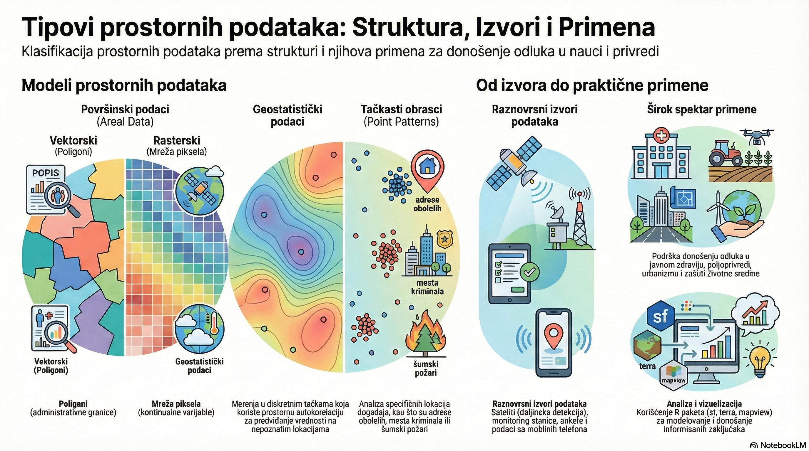
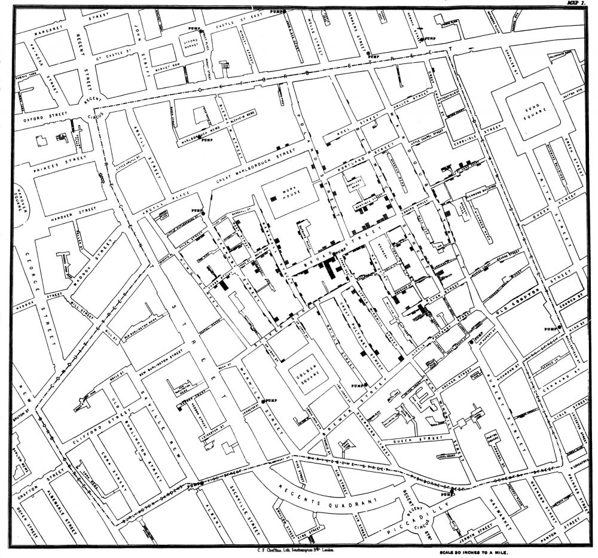
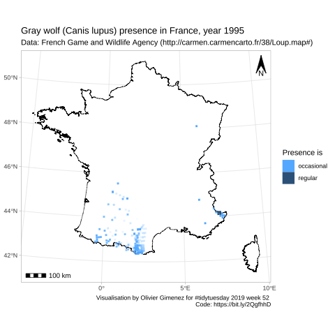
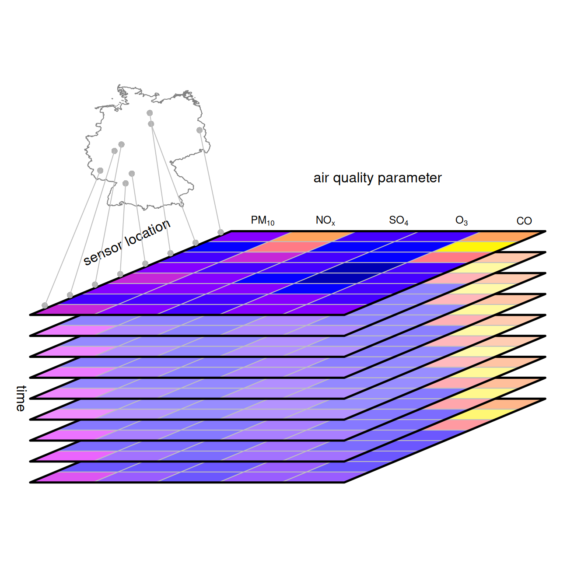

##  Info grafik





## Video pregled





## Sadržaj

```{mermaid}
%%| fig-width: 10
%%| fig-height: 6
flowchart LR
    A[Tipovi prostornih podataka] --> B[Površinski podaci];
    B --> C[Vektorski];
    B --> D[Rasterski];
    A --> E[Geostatistički podaci];
    A --> F[Point pattern];
    A --> G[Prostorno vremenski podaci];
    G --> H[Površinski];
    G --> I[Geostatistički];
    G --> J[Point pattern];
    A --> K[Spatial functional data];
    A --> L[Podaci o kretanju - Mobility data];
```


## Uvod

Prostorni podaci se koriste u različitim oblastima za podršku donošenju odluka vezanih za:

✅ **Zaštitu životne sredine** 🌱\
✅ **Javno zdravlje** 🏥\
✅ **Ekologiju** 🦅\
✅ **Poljoprivredu** 🌾\
✅ **Urbanističko planiranje** 🏙️\
✅ **Ekonomiju i društvo** 📈

Prostorni podaci omogućavaju **analizu, modelovanje i vizualizaciju** kako bi se doneli informisani zaključci i odluke.

## 📡 Izvori prostornih podataka

Prostorni podaci dolaze iz različitih izvora koji omogućavaju **praćenje, analizu i donošenje odluka**.

🔹 **Daljinska detekcija** 🛰️\
- Sateliti i dronovi omogućavaju snimanje korišćenja zemljišta i ekoloških promena.

🔹 **Monitoring stanice** 🌡️\
- Beleže podatke o temperaturi, padavinama, kvalitetu vazduha i drugim ekološkim promenljivama.

🔹 **Ankete i istraživanja** 📋\
- Sakupljaju informacije o društvenim, ekonomskim i zdravstvenim faktorima.

🔹 **Mobilni telefoni i društvene mreže** 📱\
- Omogućavaju informacije o lokaciji, aktivnostima i kretanju korisnika.

Prostorni podaci iz ovih izvora igraju ključnu ulogu u analizi i donošenju strateških odluka.

## 🗺️ Tipovi prostornih podataka

Prostorni podaci mogu se klasifikovati prema njihovoj **strukturi i načinu reprezentacije**.

```{mermaid}
%%| fig-width: 10
%%| fig-height: 6
flowchart LR
    A[Tipovi prostornih podataka] --> B[Površinski podaci];
    B --> C[Vektorski];
    B --> D[Rasterski];
    A --> E[Geostatistički podaci];
    A --> F[Point pattern];
    A --> G[Prostorno vremenski podaci];
    G --> H[Površinski];
    G --> I[Geostatistički];
    G --> J[Point pattern];
    A --> K[Spatial functional data];
    A --> L[Podaci o kretanju - Mobility data];
 
```

# Površinski podaci (*Areal Data*)

## 🗺️ Površinski podaci (*Areal Data*)

Površinski podaci predstavljaju **agregirana merenja** u prostoru, organizovana prema oblastima, administrativnim jedinicama ili pikselima.

### 🏛️ **Kako nastaju površinski podaci?**

📌 **Merenja se grupišu po predefinisanim oblastima** (*opštine, regije, klimatske zone...*).

📌 **Mogu biti predstavljeni vektorski** (poligoni) **ili rasterski** (pikseli).

📌 **Koriste se u različitim disciplinama** kao što su epidemiologija, ekologija i klimatologija.

## **Primeri primene površinskih podataka**

📍 **Prostorna epidemiologija** 🏥\
- Slučajevi bolesti se **agregiraju unutar administrativnih oblasti** (npr. po opštinama).\
- Omogućava **analizu širenja bolesti i javnozdravstvenih rizika**.

🌍 **Daljinska detekcija** 🛰️\
- Sateliti pružaju podatke o **temperaturi, padavinama i vegetaciji** na nivou piksela.\
- Koristi se za **monitoring klimatskih promena, poljoprivredu i ekologiju**.

## 📊 **Vektorski vs. Rasterski pristup**

| Tip površinskih podataka | Opis | Primeri |
|------------------|-------------------------------|-----------------------|
| 🏙️ **Vektorski** | Podaci su organizovani kao poligoni (opštine, regije) | Popisna statistika, epidemiologija |
| 🌄 **Rasterski** | Prostorni podaci su predstavljeni mrežom piksela | Satelitski snimci, klimatski modeli, DEM |

✅ **Vektorski podaci** su korisni kada je fokus na administrativnim ili političkim jedinicama.\
✅ **Rasterski podaci** su idealni za kontinualne varijable poput temperature i vlažnosti.

## 🗺️ Prikaz broja iznenadnih smrti odojčadi

::: {style="font-size:22px"}
Prikaz **broja iznenadnih smrti odojčadi** (*Sudden Infant Death Syndrome - SIDS*)\
u svakom okrugu **Severne Karoline, SAD**, za **1974. i 1979. godinu**.

Ovi podaci su deo **sf** paketa (*Pebesma, 2022*) i koriste se za **analizu prostorne distribucije smrtnosti odojčadi**.
:::

```{r echo=TRUE}
library(sf)
library(mapview)
d <- st_read(system.file("shape/nc.shp", package = "sf"),
             quiet = TRUE)
mapview(d, zcol = "SID74")
```

## 🗺️ Primer površinskih podatak o prihodima

Prikaz **medijane prihoda domaćinstava** po popisnim jedinicama u **Distriktu Kolumbija**,\
na osnovu podataka iz [walker-data](https://walker-data.com/census-r/mapping-census-data-with-r.html).

### 📊 **Ovi podaci omogućavaju:**

✅ Analizu **prostorne raspodele prihoda** među različitim oblastima.\
✅ Razumevanje **ekonomskih razlika** između popisnih jedinica.\
✅ Pomoć pri **razvoju strategija za ekonomske politike** i urbani razvoj.

------------------------------------------------------------------------

## 🗺️ Primer površinskih podatak o prihodima

```{r echo=TRUE}
library(tidycensus)
options(tigris_use_cache = TRUE)
dc_income <- get_acs(
  geography = "tract", 
  variables = "B19013_001",
  state = "DC", 
  year = 2020,
  geometry = TRUE)

mapview(dc_income, zcol="estimate")
```

## 🌄 Primer površinskih podataka DEM

Prikaz **nadmorske visine** u ćelijama rastera koje pokrivaju **Luksemburg**, iz **terra** paketa (*Hijmans, 2022*).

U ovom slučaju, sve oblasti su iste veličine, odgovaraju pikselima rastera.


```{r echo=TRUE}
library(terra)
d <- rast(system.file("ex/elev.tif", package = "terra"))
plot(d)
```

## 🌄 Primer površinskih podataka Zlatibor

```{r}
library(terra)
library(sf)
library(geodata)
# Warning: package 'geodata' was built under R version 4.2.3

# alt = elevation_30s('SRB', path=tempdir() )
# terra::res(alt)
# 0.008333333 rezolucija oko 1km rezolucija 
# 0.008333333*pi/180*6377 km je 0.93 km

alt = rast("/vsicurl/https://zenodo.org/record/6211553/files/copernicus_DSM_30arcsec_mood_bbox_epsg4326.tif") 
# https://zenodo.org/record/6211553
names(alt) = "h"
zlatibor = crop(alt, ext(19.65,19.75, 43.60, 43.75)) 
# meters * 1000 (scaled to Integer; example: value 23220 = 23.220 m a.s.l.)
values(zlatibor) =  round(values(zlatibor)/1000)

pol = st_as_sf(as.polygons(zlatibor, dissolve=FALSE) )
plot(zlatibor, col= terrain.colors(160,alpha=0.5) )
cc = st_coordinates(st_centroid(st_geometry(pol)))
text(cc[, 1], cc[, 2], labels = paste( pol$h) , cex=0.4 )
```

## 🌄 Primer površinskih podataka Zlatibor

```{r, echo=TRUE, eval=FALSE}
library(terra)
library(sf)
library(geodata)

# alt = elevation_30s('SRB', path=tempdir() )
# terra::res(alt)
# 0.008333333 rezolucija oko 1km rezolucija 
# 0.008333333*pi/180*6377 km je 0.93 km

alt = rast("/vsicurl/https://zenodo.org/record/6211553/files/copernicus_DSM_30arcsec_mood_bbox_epsg4326.tif") 
# https://zenodo.org/record/6211553
names(alt) = "h"
zlatibor = crop(alt, ext(19.65,19.75, 43.60, 43.75)) 
# meters * 1000 (scaled to Integer; example: value 23220 = 23.220 m a.s.l.)
values(zlatibor) =  round(values(zlatibor)/1000)

pol = st_as_sf(as.polygons(zlatibor, dissolve=FALSE) )
plot(zlatibor, col= terrain.colors(160,alpha=0.5) )
cc = st_coordinates(st_centroid(st_geometry(pol)))
text(cc[, 1], cc[, 2], labels = paste( pol$h) , cex=0.4 )
```

# Geostatistički podaci

## 📍 Geostatistički podaci

Geostatistički podaci predstavljaju **merenja koja su dostupna samo na određenim tačkama u prostoru**.\
Koriste se za **predviđanje vrednosti u nepoznatim lokacijama** uzimajući u obzir **prostornu autokorelaciju**.


#### 🔬 **Karakteristike geostatističkih podataka**

✅ **Diskretni uzorci** – merenja su dostupna **samo na ograničenom broju lokacija**.\
✅ **Kontinuirani fenomeni** – vrednosti između mernih tačaka moraju se **modelovati ili interpolirati**.\
✅ **Prostorna autokorelacija** – najčešće bliske lokacije imaju **sličnije vrednosti** nego udaljene tačke.


## 🏭 **Primer: Zagađenje vazduha**

📌 **Problem:** Želimo da predvidimo **nivo zagađenja vazduha** u gradovima na osnovu **merenja sa stanica**.\
📌 **Rešenje:**\
- Koristimo **merenja sa postojećih mernih stanica**.\
- Primenujemo **geostatističke metode** (npr. **Kriging, IDW**) za **predikciju vrednosti na nepoznatim lokacijama**.\
- Uzimamo u obzir **prostornu autokorelaciju i ekološke faktore** (vremenske uslove, nadmorsku visinu, industriju).

📊 **Ovi podaci se koriste u:**

-   📍 **Meteorologiji** (predikcija temperature, padavina)
-   🏭 **Ekologiji** (zagađenje vazduha, kvaliteta vode)
-   🚜 **Poljoprivredi** (vlaga u zemljištu, raspodela hranljivih materija)

------------------------------------------------------------------------

## Geostatistički podaci primer meuse

Prikaz koncentracije olova u gornjem sloju zemljišta (mg po kg zemljišta) na 155 lokacija uzetih na plavnoj ravnici reke Meuse, u blizini Steina, Holandija, dobijene iz sp paketa (Pebesma i Bivand, 2022).


```{r echo=TRUE}
library(sp)
library(sf)
library(mapview)
data(meuse)
meuse <- st_as_sf(meuse, coords = c("x", "y"), crs = 28992)
mapview(meuse, zcol = "lead",  map.types = "CartoDB.Voyager")
```

## Geostatistički podaci primer ekonometrija

Karta prikazuje cenu po kvadratnom metru (Evra po kvadratnom metru) za specifičan skup stanova u Atini, Grčka, iz 2017. godine, preuzetu iz spData paketa (Bivand, Nowosad, i Lovelace, 2022).

```{r echo=TRUE}
library(spData)
mapview(properties, zcol = "prpsqm")
```

# Tačkasti obrasci (*Point Patterns*)

## 📍 Tačkasti obrasci (*Point Patterns*)

Tačkasti obrasci se javljaju kada **analizirana varijabla odgovara lokaciji određenog događaja**,\
kao što su **požari u šumi, lokacije kriminalnih incidenata ili adrese obolelih osoba**.

#### 🔎 **Cilj analize tačkastih obrazaca**

✅ Razumevanje **prostornog procesa** koji generiše ove tačke.\
✅ Identifikacija **prostorne strukture** – da li se tačke grupišu, nasumično raspoređuju ili pokazuju pravilnost.\
✅ Pomoć pri **predikciji budućih događaja** i donošenju odluka zasnovanih na podacima.

## **Primeri tačkastih obrazaca u praksi**

📌 **Epidemiologija** 🏥\
- Karte **adresa obolelih osoba** omogućavaju analizu prostorne distribucije bolesti.\
- Može se ispitivati **prisustvo klastera** u vezi sa ekološkim faktorima.

📌 **Ekologija** 🌲🔥\
- Analiza **lokacija požara u šumi** pomaže u identifikaciji uzroka i sprečavanju budućih požara.\
- Omogućava razumevanje **uticaja klime i ljudskih aktivnosti** na požare.

📌 **Urbana geografija i kriminalistika** 🚔\
- Prostorna analiza **mesta kriminalnih incidenata** može pomoći u planiranju policijskih patrola.\
- Identifikacija **rizičnih zona** i donošenje strategija za smanjenje kriminala.

## Point patterns i geovizualizacija

::::: columns
::: {.column width="50%"}
[Engleski akušer Džon Snou dokazao je da se kolera 1854. u Londonu širila zagađenom vodom sa pumpe u Broad ulici. Kartirao je adrese zaraženih.]{style="font-size: 0.85em;"}

[Njegova karta slučajeva oko pumpe postala je simbol javnog zdravlja, a uklanjanje ručke pumpe pomoglo je zaustavljanju epidemije.]{style="font-size: 0.85em;"}

[Geovizulizacija je omogućila jasan prikaz prostornih obrazaca i razumevanje problema.]{style="font-size: 0.85em;"}
:::

::: {.column width="50%"}
{width="100%"}
:::
:::::

## Point patterns primer šumski požari

::::: columns
::: {.column width="50%"}
[Primer prostornog tačkastog obrasca su požari u Castilla-La Manchi, Španija, između 1998. i 2007. godine, sadržani u clmfires podacima iz spatstat paketa (Baddeley, Turner i Rubak, 2022). Podaci clmfires predstavljaju označeni tačkasti obrazac sa informacijama o svakom požaru.]{style="font-size: 0.7em;"}
:::

::: {.column width="50%"}
```{r , echo=TRUE, eval=TRUE}
# Učitavanje paketa za analizu tačkastih obrazaca
library(spatstat)
# Ekstrahovanje godina iz datuma požara
yr  <- factor(format(marks(clmfires)$date, format="%Y"))
# Grupisanje požara po godinama
X   <- split(clmfires, f=yr)
# Odabir godina za prikaz
fAl <- c("1998", "2007")
# Podešavanje margina grafika
par(mar = c(1, 1, 2, 1))
# Iscrtavanje požara za odabrane godine
plot(X[fAl], use.marks=FALSE, main.panel=fAl, main="", pch = "+")
```
:::
:::::

## Šumski požari point pattern

```{r, echo=FALSE, eval=TRUE}
library(spatstat)
# Split the clmfires pattern by year and plot the first and last years:
yr  <- factor(format(marks(clmfires)$date,format="%Y"))
X   <- split(clmfires,f=yr)
fAl <- c("1998","2007")
par(mar = c(1, 1, 2, 1))
plot(X[fAl],use.marks=FALSE,main.panel=fAl,main="" , pch = "+")
```

# Prostorno-vremenski podaci

## ⏳ Prostorno-vremenski podaci

Prostorno-vremenski podaci nastaju kada su informacije **istovremeno prostorno i vremenski referencirane**.\
Mogu se posmatrati kao **vremenske agregacije** ili **vremenski preseci** prostorno-vremenskog procesa.

### 🔑 **Zašto su prostorno-vremenski podaci važni?**

✅ Omogućavaju **analizu promena kroz vreme i prostor**.\
✅ Koriste se za **predviđanje i donošenje odluka u realnom vremenu**.\
✅ Ključni su u **meteorologiji, ekologiji, urbanizmu i javnom zdravlju**.

## 📊 **Primeri prostorno-vremenskih podataka**

📍 **Površinski podaci** 🏙️\
- **Broj saobraćajnih nesreća** u svakoj američkoj saveznoj državi za svaki mesec 2020. godine.\
- Omogućava analizu **sezonskih i regionalnih obrazaca nesreća**.

📍 **Geostatistički podaci** 🌍\
- **Nivo zagađenja vazduha** meren na **100 stanica u Nemačkoj svakog sata određenog dana**.\
- Koristi se za **predikciju i modelovanje kvaliteta vazduha kroz vreme i prostor**.

📍 **Tačkasti obrasci** 📌\
- **Lokacije zemljotresa** u svetu za svaku godinu od **2000. do 2020.**\
- Omogućava analizu **učestalosti i prostorne distribucije seizmičkih aktivnosti**.

## Prostorno vremenski vektorski površinski podaci

```{r echo=TRUE, eval=FALSE}
library(tmap)
library(sf)
system.file("gpkg/nc.gpkg", package = "sf") |>
    read_sf() |> st_transform('EPSG:32119') -> nc.32119
tm_shape(nc.32119) + 
    tm_polygons(c("SID74", "SID79"), title = "SIDS") +
    tm_layout(legend.outside = TRUE, 
              panel.labels = c("1974-78", "1979-84")) +
    tm_facets(free.scales=FALSE)
```

## Prostorno vremenski vektorski površinski podaci

```{r }
library(tmap)
library(sf)
system.file("gpkg/nc.gpkg", package = "sf") |>
    read_sf() |> st_transform('EPSG:32119') -> nc.32119
tm_shape(nc.32119) + 
    tm_polygons(c("SID74", "SID79"), title = "SIDS") +
    tm_layout(legend.outside = TRUE, 
              panel.labels = c("1974-78", "1979-84")) +
    tm_facets(free.scales=FALSE)
```

## Prostorno vremenski rasterski površinski podaci

NDVI indeks za područje planine Kilimandžaro.

```{r, echo=TRUE, eval=FALSE}
library(raster)
library(mapview)
library(leafsync)
kili_data <- system.file("extdata", "kiliNDVI.tif", package = "mapview")
kiliNDVI <- stack(kili_data) # 23 lejera u seriji
library(RColorBrewer)
clr <- colorRampPalette(brewer.pal(9, "YlGn")) # paleta boja
m1 <- mapview(kiliNDVI[[1]] , col.regions = clr, 
              legend = TRUE, map.types = "Esri.WorldImagery")
m2 <- mapview(kiliNDVI[[5]], col.regions = clr ,
              legend = TRUE, map.types = "Esri.WorldImagery")
m3 <- mapview(kiliNDVI[[10]], col.regions = clr, 
              legend = TRUE, map.types = "Esri.WorldImagery")
m4 <- mapview(kiliNDVI[[20]],col.regions = clr, 
              legend = TRUE, map.types = "Esri.WorldImagery")
sync(m1, m2, m3, m4) # 4 panela sinhronizovana
```

## NDVI Kilimandžaro

```{r echo=FALSE, eval=TRUE}
library(raster)
library(mapview)
library(leafsync)
kili_data <- system.file("extdata", "kiliNDVI.tif", package = "mapview")
kiliNDVI <- stack(kili_data) # 23 lejera u seriji
library(RColorBrewer)
clr <- colorRampPalette(brewer.pal(9, "YlGn")) # paleta boja
m1 <- mapview(kiliNDVI[[1]] , col.regions = clr, 
              legend = TRUE, map.types = "Esri.WorldImagery")
m2 <- mapview(kiliNDVI[[5]], col.regions = clr ,
              legend = TRUE, map.types = "Esri.WorldImagery")
m3 <- mapview(kiliNDVI[[10]], col.regions = clr, 
              legend = TRUE, map.types = "Esri.WorldImagery")
m4 <- mapview(kiliNDVI[[20]],col.regions = clr, 
              legend = TRUE, map.types = "Esri.WorldImagery")
sync(m1, m2, m3, m4) # 4 panela sinhronizovana
```

## 🌧️ Prostorno-vremenski rasterski površinski podaci 2

Mesečni podaci o **padavinama** na osnovu **BCSD klimatskih projekcija**.\
Ovi podaci omogućavaju analizu **klimatskih obrazaca i promena u različitim regionima** kroz vreme.

```{r, echo=TRUE}
library(stars)
system.file("nc/bcsd_obs_1999.nc", package = "stars") |> read_stars() -> w
plot(w)
```

## Zemljotresi prostorno vremenski point pattern podaci

```{r, echo=TRUE}
library(lubridate)
if ("all_week.csv" %in% dir(".") == FALSE) {
  url <- "https://earthquake.usgs.gov/earthquakes/feed/v1.0/summary/all_week.csv"
  download.file(url = url, destfile = "all_week.csv") # Preuzimanje fajla i čuvanje lokalno
  }
# Učitavanje CSV fajla u R kao dataframe 'quakes'
quakes <- read.csv("all_week.csv", header = TRUE, sep = ',', stringsAsFactors = FALSE)
# Pretvaranje kolone 'time' iz tekstualnog formata u datum-vrijeme format (POSIXct)
quakes$time <- ymd_hms(quakes$time)
# Pretvaranje kolone 'updated' u isti datum-vrijeme format
quakes$updated <- ymd_hms(quakes$updated)
# Pretvaranje kategorijskih (faktorskih) varijabli za lakše analiziranje i filtriranje podataka
quakes$magType <- as.factor(quakes$magType)         # Tip magnitude (npr. ML, MB, MW)
quakes$net <- as.factor(quakes$net)                 # Mreža koja je zabilježila potres
quakes$type <- as.factor(quakes$type)               # Tip događaja (npr. "earthquake", "quarry blast")
quakes$status <- as.factor(quakes$status)           # Status događaja (npr. "reviewed", "automatic")
quakes$locationSource <- as.factor(quakes$locationSource) # Izvor informacija o lokaciji
quakes$magSource <- as.factor(quakes$magSource)     # Izvor informacija o magnitudi
# Filtriranje podataka tako da ostanu samo zapisi koji se odnose na zemljotrese
earthquakes <- quakes[quakes$type == "earthquake",]
```

## Zemljotresi interaktivna karta

```{r, echo=TRUE}
paste("Karta mljotresa za period od ", earthquakes$time[nrow(earthquakes)], earthquakes$time[1] , sep = " do ")
```

```{r, echo=TRUE}
library(mapview)
df <- st_as_sf(x = earthquakes, coords = c("longitude", "latitude"), crs = 4326)
mapview(df, zcol = "mag", legend = TRUE, map.types = c("CartoDB.Positron"), cex= 4, alpha = 0.3)
```

## Prostorno vremenski tačkasti obrasci pojava vukova u Francuskoj kroz vreme

{fig.align="center" width="80%"}


## Prostorno-vremenski geostatistički podaci

Prostorno-vremenski geostatistički podaci koriste se za analizu **kontinuiranih fenomena** koji se menjaju kroz prostor i vreme.

### 📊 **Podaci o kvalitetu vazduha**

✅ **Izvor:** *airBase* – Evropska baza podataka o kvalitetu vazduha.\
✅ **Obuhvat:** Dnevni proseci za **ruralne stanice u Nemačkoj** (1998–2009).\
✅ **Cilj analize:** Razumevanje **prostorno-vremenskih promena u kvalitetu vazduha** na nivou regiona.

🔗 Više informacija: [air](https://search.r-project.org/CRAN/refmans/spacetime/html/air.html)

## Prostorno vremenski geostatisički podaci

```{r, echo=TRUE}
library(spacetime)
data(air)
rural = STFDF(stations, dates, data.frame(PM10 = as.vector(air)))
stplot(rural[,4378:4383])
# poslednjih 6 dana iz podatka
```

## Prostorno vremenski geostatisički podaci

https://r-spatial.org/book/06-Cubes.html



# Prostorni funkcionalni podaci

## Prostorni funkcionalni podaci

Prostorni funkcionalni podaci nastaju kada se tri tipa prostornih podataka (površinski, geostatistički i tačkasti obrasci) kombinuju sa nasumičnim funkcijama.

Primer ispod prikazuje **funkcionalne geostatističke podatke** iz paketa **geoFourierFDA** (*Sassi 2021*), koji predstavljaju prosečnu dnevnu temperaturu tokom 30 godina na **14 meteoroloških stanica u Kanadi**:

$$
\{\chi_{s_i} : i = 1, \dots, 35\}
$$

### 📊 **Zašto su prostorni funkcionalni podaci korisni?**

✅ Omogućavaju **detaljno modelovanje kontinualnih procesa u prostoru**.\
✅ Mogu se koristiti za **predikciju prostorno-vremenskih trendova**.

## Prostorni funkcionalni podaci

Lokacije kanadskih meteoroloških stanica.

```{r, echo=TRUE, eval=TRUE}
library(sf)               # Paket za rad sa prostornim podacima
library(geoFourierFDA)    # Paket za geofourier analizu, pak::pkg_install("geoFourierFDA")
library(rnaturalearth)    # Paket za preuzimanje geografskih podataka
library(ggplot2)          # Paket za vizuelizaciju podataka
# Učitavanje karte Kanade sa granicama provincija
map <- rnaturalearth::ne_states("Canada", returnclass = "sf") 
# Kreiranje data frame-a sa koordinatama stanica
d <- data.frame(canada$m_coord) 
# Dodavanje naziva stanica
d$location <- attr(canada$m_coord, "dimnames")[[1]]           
d <- st_as_sf(d, coords = c("W.longitude", "N.latitude"))     
st_crs(d) <- 4326                                             

ggplot(map) + geom_sf() +                                     # Prikaz karte Kanade
  geom_sf(data = d, size = 6) +                               # Dodavanje lokacija stanica na karti
  geom_sf_label(data = d, aes(label = location), nudge_y = 2) # Oznake sa imenima stanica
```


## Prostorni funkcionalni podaci

Dnevne temperature, agregirana dnevna merenja tokom 30 godina na 10 kanadskih meteoroloških stanica.

```{r, echo=TRUE, eval=TRUE}
d <- data.frame(canada$m_data)                    # Učitavanje temperaturnih podataka stanica
d$time <- 1:nrow(d)                               # Dodavanje vremenske ose (indeksiranje po redovima)

df <- tidyr::pivot_longer(data = d,               # Pretvaranje podataka iz širokog u dugi format
  cols = names(d)[-which(names(d) == "time")],    # Odabir kolona koje se pivotiraju (sve osim 'time')
  names_to = "variable", values_to = "value")     # 'variable' sadrži imena stanica, 'value' njihove vrijednosti

ggplot(df, aes(x = time, y = value)) +            # Kreiranje linijskog grafa temperature kroz vrijeme
  geom_line(aes(color = variable))                # Prikaz promjene temperature po stanicama različitim bojama
```

## Prostorni funkcionalni podaci

Jedan od ciljeva analize ovih podataka mogao bi biti **predikcija dnevne temperaturne funkcije**:

$$
X_{s0}:[0,365)→R 
$$

na nekoj lokaciji na kojoj nema opažanja. Ovo bi se moglo postići korišćenjem funkcionalnih geostatističkih metoda, kao što je **Kriging** ili **Fourierova analiza** iz paketa *geoFourierFDA*.

## Karta najverovatnijih temperatura za 1.01 bilo koje godine

Priprema podataka za prostornu interpolaciju.

```{r, echo=TRUE}
# Učitavanje potrebnih paketa
library(sf)        # Rad sa prostornim podacima
library(gstat)     # Geostatističke analize i kriging
library(terra)     # Rad sa raster podacima za predikciju
library(tidyr)     # Transformacija podataka
library(ggplot2)   # Vizualizacija rezultata

# Podaci o temperaturi za sve stanice
d <- data.frame(canada$m_data)
d$time <- 1:nrow(d)
head(d)

```

## Transformacija podataka

```{r, echo=TRUE}
# Pretvaranje podataka iz širokog u dugi format
df <- tidyr::pivot_longer(data = d, 
                          cols = names(d)[-which(names(d) == "time")], 
                          names_to = "station", values_to = "temperature")
head(df)
# Filtriranje podataka samo za prvi dan
df_day1 <- df[df$time == 1, ]

head(df_day1)
```

## Interpolacija funkcionalnih podataka

Priprema podataka za prostornu interpolaciju kreiranje sf objekata.

```{r, echo=TRUE}
# Dodavanje koordinata stanicama
coords <- data.frame(canada$m_coord)
df_day1$lon <- coords$W.longitude
df_day1$lat <- coords$N.latitude

# Pretvaranje u prostorni objekat (sf format)
stations_sf <- st_as_sf(df_day1, coords = c("lon", "lat"), crs = 4326)

# Transformacija u projekcioni sistem (za mjerenje udaljenosti u metrima)
stations_sf <- st_transform(stations_sf, crs = 3347)  # Lambert Conformal Conic za Kanadu
head(stations_sf)
```

## Kreiranje rastera i predikcija

```{r, echo=TRUE}
# Definisanje raster mreže za predikciju (rezolucija 10 km)
canada_bbox <- st_bbox(stations_sf)
r <- raster(xmn = canada_bbox["xmin"], xmx = canada_bbox["xmax"], 
            ymn = canada_bbox["ymin"], ymx = canada_bbox["ymax"], 
            res = 10000, crs = st_crs(stations_sf)$proj4string) # 10 km rezolucija

# Konvertovanje rastera u tačke za predikciju
prediction_points <- rasterToPoints(r, spatial = TRUE)
prediction_points_sf <- st_as_sf(prediction_points)


idw_model = gstat(formula = temperature ~ 1, 
               data = stations_sf, 
               set = list(idp = 2))

# Konvertovanje raster sloja u SpatialPixelsDataFrame za gstat
grd <- as(r, "SpatialPixelsDataFrame")
predikcija = predict(idw_model, grd)
```

## Plot i karta

```{r, echo=TRUE}

okruziKanada = st_transform(map, crs = 3347)
## Kreiranje rastera i predikcija
# Temperaturna predikcija
plot(raster(predikcija), main = "IDW Predikcija Temperature (10 km)", col = terrain.colors(100)) 
# Granice Kanade
plot(st_geometry(okruziKanada), add = TRUE, border = "black", lwd = 1)      # Stanice            
plot(st_geometry(stations_sf), add = TRUE, pch ='+', col='red', cex = 1.5) 

```

## Primer funkcionalnih rasterskih podataka TESSERA





# 🚶 Podaci o kretanju

## 🚶 Podaci o kretanju

Podaci o kretanju prikazuju **broj pojedinaca ili drugih elemenata** koji se kreću između lokacija (*Mahmood et al., 2022*).\
Koriste se za **analizu migracija, transporta, širenja bolesti i ekonomskih tokova**.

### 🔬 **Primer: Analiza tokova populacije u Brazilu**

Ovi podaci dolaze iz paketa **epiflows** (*Piatkowski et al., 2018; Moraga et al., 2019*).\
Omogućavaju **predikciju i vizualizaciju širenja zaraznih bolesti** na osnovu kretanja između geografskih lokacija.

📌 **Paket `epiflows` sadrži dataset `Brazil_epiflows`**\
- Prikazuje broj **putnika između brazilskih saveznih država i drugih lokacija**.\
- Ovi podaci omogućavaju kreiranje *epiflows* objekta (**ef**), koji se koristi za analizu tokova kretanja.

## Podaci o kretanju primer

```{r, echo=TRUE, eval=FALSE}
library("epiflows")
data("Brazil_epiflows")

loc <- merge(x = YF_locations, y = YF_coordinates,
by.x = "location_code", by.y = "id", sort = FALSE)

ef <- make_epiflows(flows = YF_flows, locations = loc,
                    coordinates = c("lon", "lat"),
                    pop_size = "location_population",
                    duration_stay = "length_of_stay",
                    num_cases = "num_cases_time_window",
                    first_date = "first_date_cases",
                    last_date = "last_date_cases")
vis_epiflows(ef)
```

## Podaci o kretanju primer interaktivni grafik

```{r}
library("epiflows")
data("Brazil_epiflows")

loc <- merge(x = YF_locations, y = YF_coordinates,
by.x = "location_code", by.y = "id", sort = FALSE)

ef <- make_epiflows(flows = YF_flows, locations = loc,
                    coordinates = c("lon", "lat"),
                    pop_size = "location_population",
                    duration_stay = "length_of_stay",
                    num_cases = "num_cases_time_window",
                    first_date = "first_date_cases",
                    last_date = "last_date_cases")
vis_epiflows(ef)
```

## Podaci o kretanju primer interaktivna karta

```{r, echo=TRUE}
map_epiflows(ef)
```

## Literatura

1. Moraga, Paula. (2023). Spatial Statistics for Data Science: Theory and Practice with R. Chapman & Hall/CRC Data Science Series. ISBN 9781032633510 [https://www.paulamoraga.com/book-spatial/](https://www.paulamoraga.com/book-spatial/)
2. [https://oliviergimenez.github.io/coding/](https://oliviergimenez.github.io/coding/)
3. [https://www.r-spatial.org/](https://www.r-spatial.org/)
4. [https://geocompr.robinlovelace.net/](https://geocompr.robinlovelace.net/)
5. Kilibarda M., Matematička kartografija, [https://osgl.grf.bg.ac.rs/books/mk/](https://osgl.grf.bg.ac.rs/books/mk/)

6. **Knjiga**: *Satellite Image Time Series Analysis on EO Data Cubes* (e-sensing)  
-   **GitHub repozitorijumi**:  
    -   [`e-sensing/sits`](https://github.com/e-sensing/sits)  
