##  Info grafik


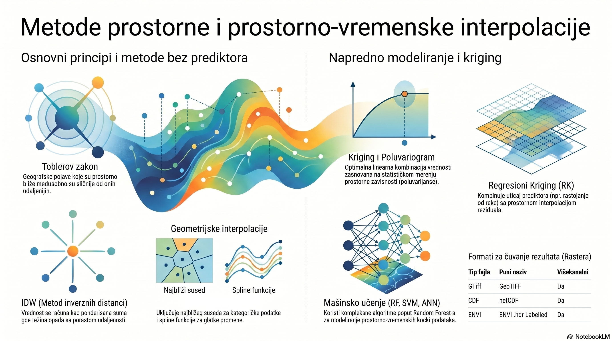


## Video pregled





# Primer prostorne interpolacije kod modeliranja sadržaja teških metala u zemljištu

## Podaci o uzorkovanju zemljišta na 155 lokacija diskretni podaci

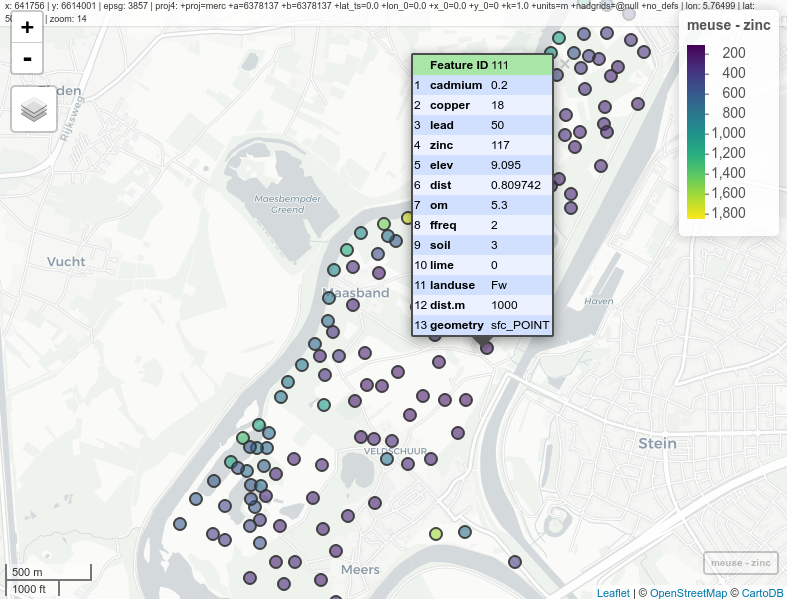

## Neophodno nam je da sračunamo kontinualne podatke u rezoluciji 40x40 m

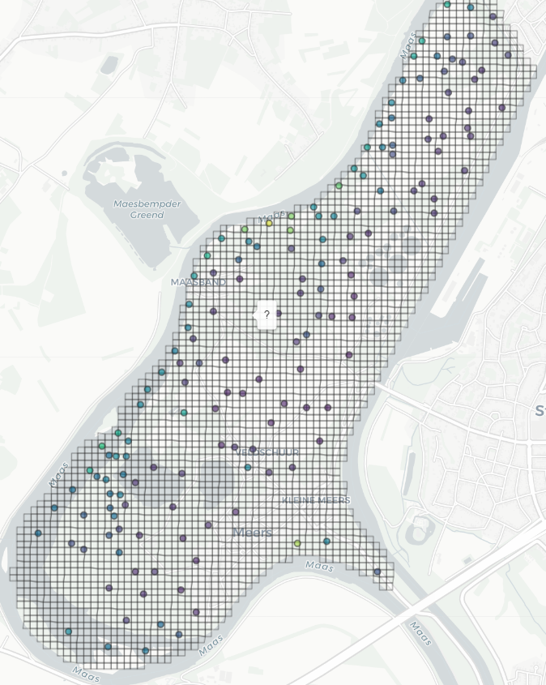

## Kako sračunati vrednost sadržaja cinka ili olova u ćeliji u kojoj nije bilo uzorkovanja

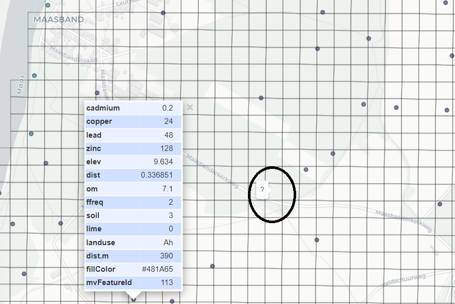

## Toblerov zakon

-   Sve pojave u geografskom prostoru su međusobno povezane, ali one koje su prostorno bliže su međusobno sličnije od onih koje su međusobno udaljenije.

-   Proračun na lokaciji koja nije merena može biti linearna ili ne-linearna kombinacija susednih opažanja.

-   Kako uzeti blizinu u obzir?

## Metod inverznih distanci

-   U ovoj metodi se vrednost na nepoznatoj lokaciji računa kao **ponderisana suma vrednosti sa poznatih lokacija**, pri čemu je težina svakog uzorka obrnuto **proporcionalna njegovoj udaljenosti** od nepoznate lokacije.

$$
z(x, y)=\frac{\sum_{i=1}^n\left[\frac{z}{d_i^p}\right]}{\sum_{i=1}^n\left[\frac{1}{d_i^p}\right]} \text { ili } \quad z(x, y)=\sum \lambda_i \times z_i \xrightarrow{\text { with }} \sum \lambda_i=1
$$

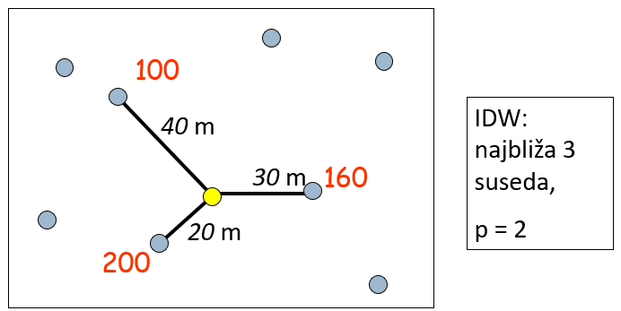

## Metod inverznih distanci

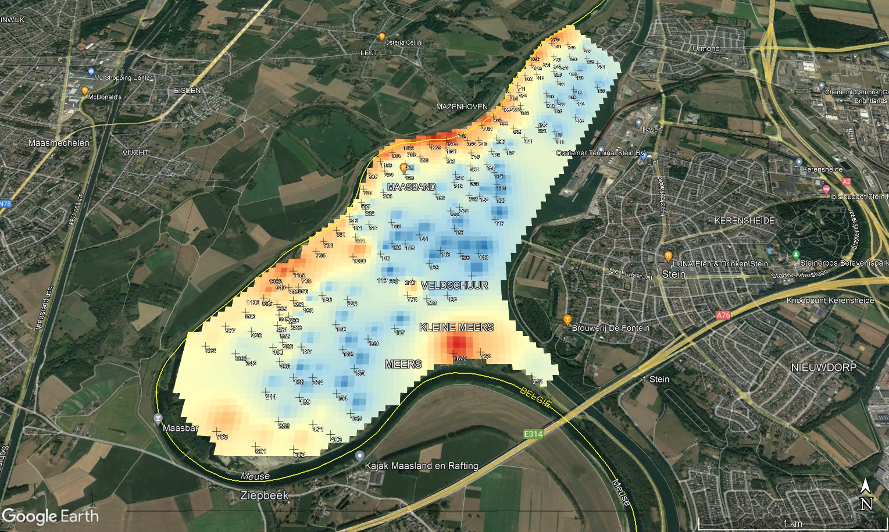

## Metod inverznih distanci

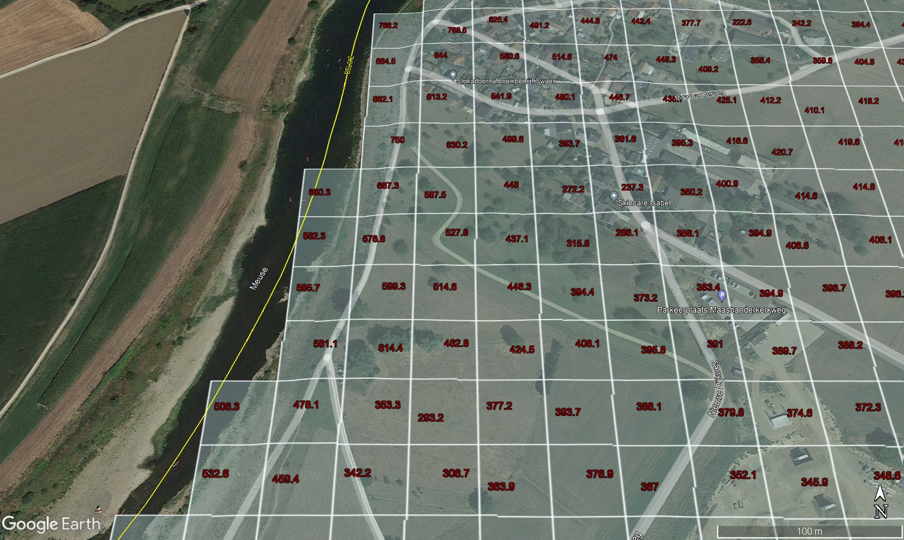

## Metod inverznih distanci

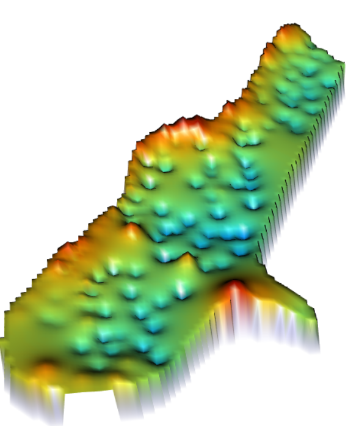

## Prethodna analiza podataka – geovizuelizacija

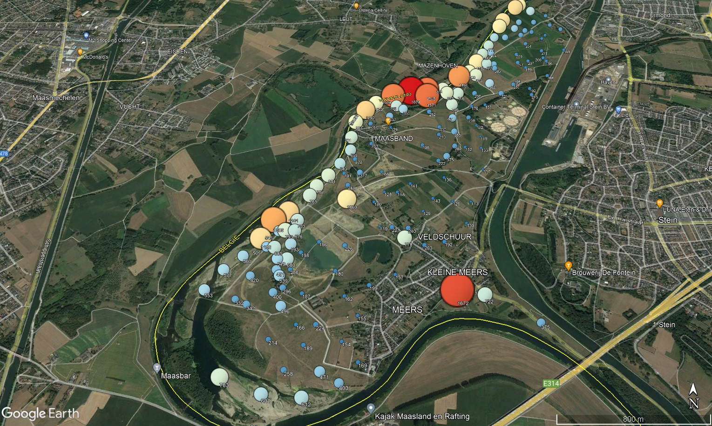

## Predhodna analiza podataka – Sadržaj cinka u zemljištu i rastojanje od reke

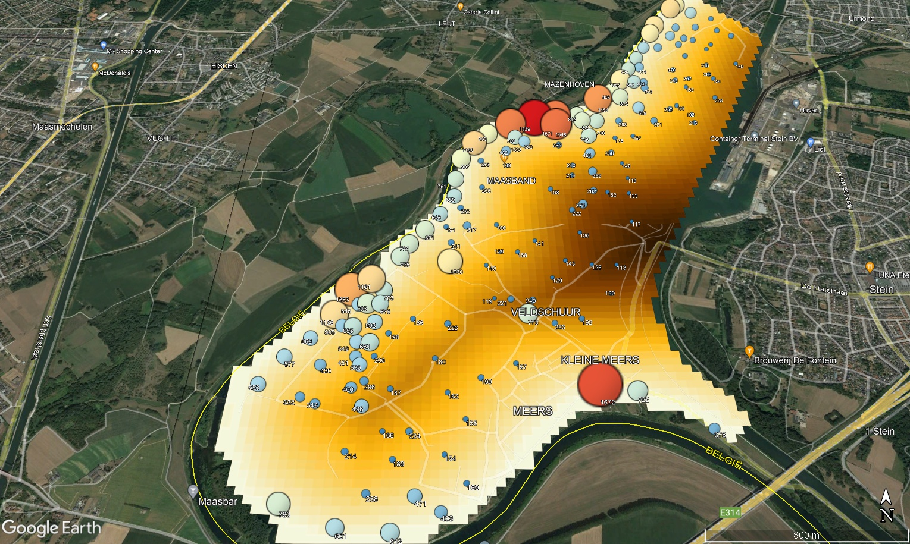

## Predhodna analiza podataka – Sadržaj cinka u zemljištu i rastojanje od reke

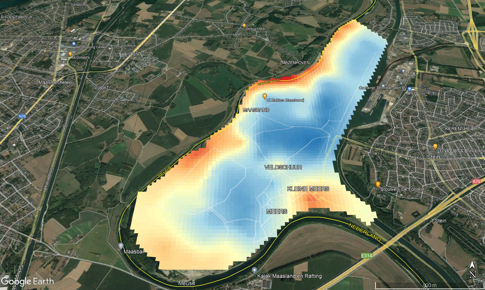

## IDW i RK

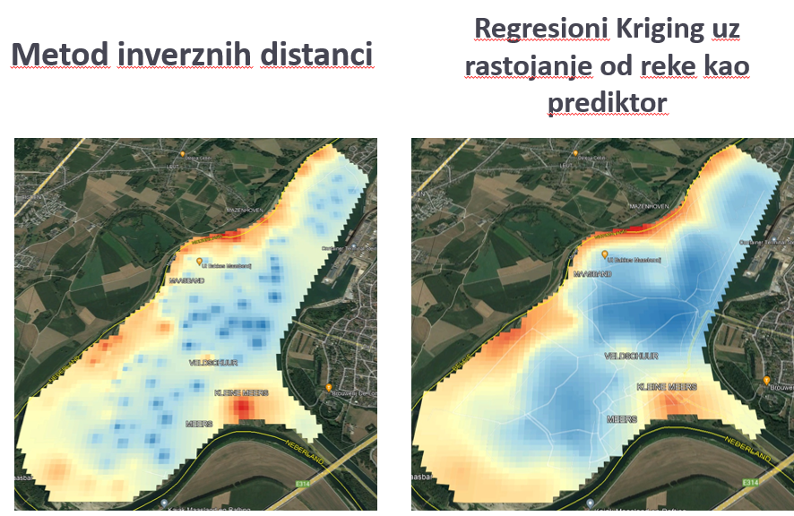

## IDW i RK

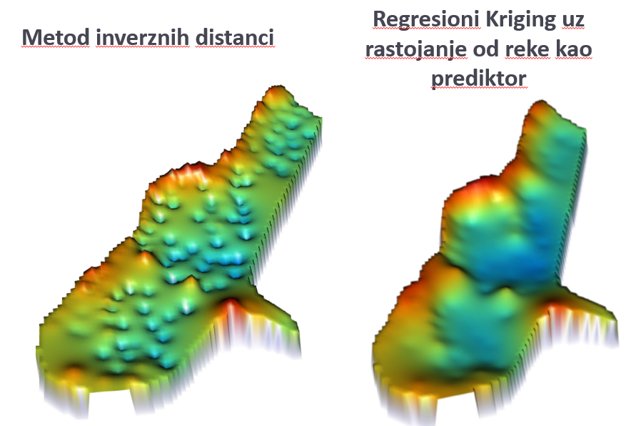

## Regresioni kriging sa više prediktora

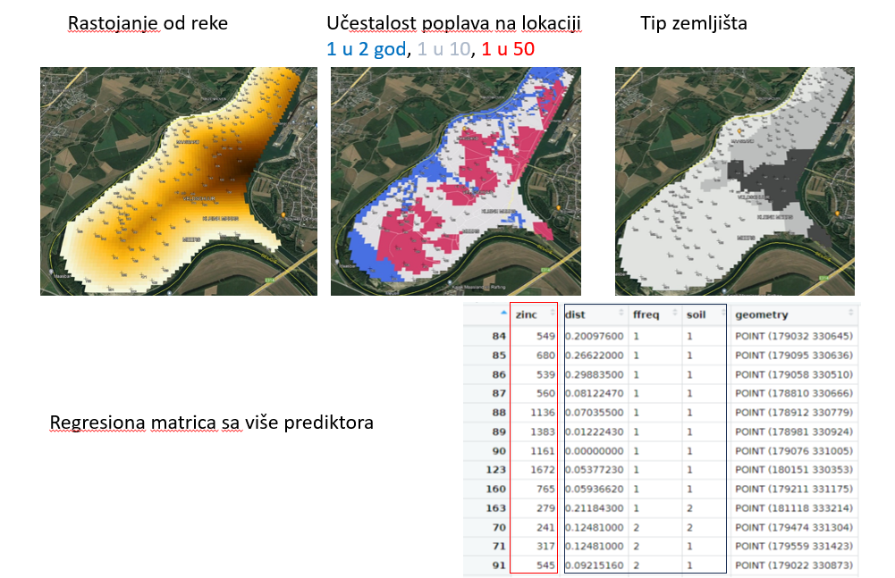

# Metode za prostornu interpolaciju

## Metode za prostornu interpolaciju bez prediktora

-   IDW (Inverse Distance Weighting)
-   Najbliži sused (Nearest Neighbour)
-   Plate spline / spline funkcije
-   Triangulacija sa linearnom interpolacijom
-   Lokalni polinomi (Local polynomial)

## Metode za prostornu interpolaciju bez prediktora

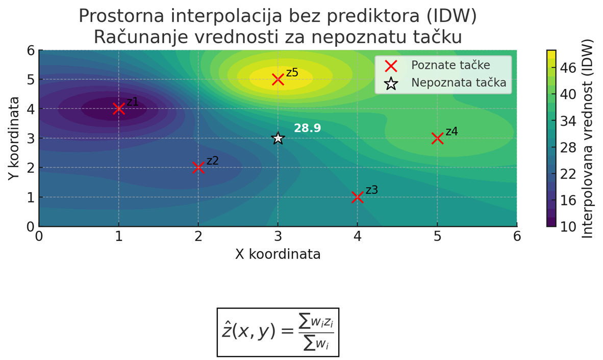

## IDW

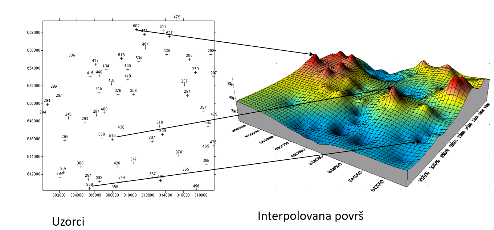

## Nearest neighbour/najbliži sused

-   Ova metoda se koristi kada je potrebno interpolirati vrednosti na tačkama koje su najbliže poznatim tačkama. U ovoj metodi se vrednost na nepoznatoj lokaciji računa kao vrednost najbližeg uzorka. Često se koristi kod kategoričkih podataka.

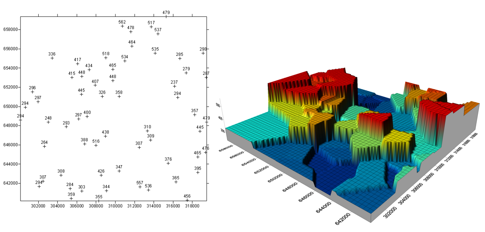

## Plate spline/spline funkcija

-   Ova metoda koristi spline funkcije za interpolaciju vrednosti između poznatih tačaka. Spline funkcije su polinomi koji su povezani u tačkama koje se nazivaju čvorovi. Ova metoda je pogodna za podatke koji imaju glatke promene.

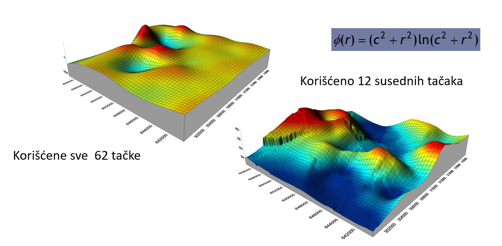

## Triangulacija sa linearnom interpolacijom

-   Ova metoda koristi triangulaciju da bi se stvorila mreža trouglova između poznatih tačaka. Vrednosti se zatim interpoliraju unutar svakog trougla koristeći linearnu interpolaciju. Ova metoda je pogodna za podatke koji imaju oštre promene.

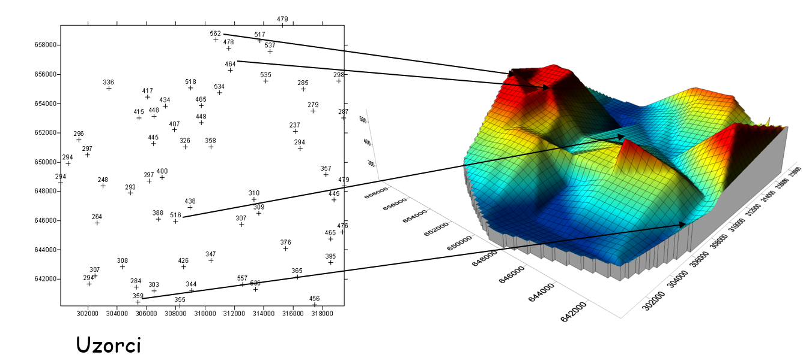

## Lokalni polinomi

-   Ova metoda koristi lokalne polinome za interpolaciju vrednosti između poznatih tačaka. Lokalni polinomi su polinomi koji se koriste samo u malom okruženju oko tačke koja se interpolira. Ova metoda je pogodna za podatke koji imaju lokalne promene.

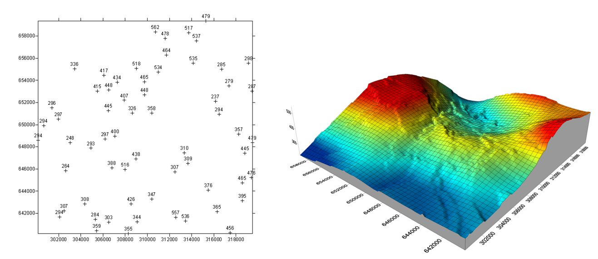

## Kriging

-   Kriging je metoda koja koristi prostornu autokorelaciju da bi se procenile vrednosti na nepoznatim lokacijama. Ova metoda koristi **poluvariogram** za određivanje optimalnih težina za svaku poznatu tačku, kako bi znali uticaj svake tačke na vrednost na nepoznatoj lokaciji, na osnovu udaljenosti od poznatih tačaka.

-   **Poluvariogram** meri koliko se vrednosti razlikuju zavisno od njihove međusobne udaljenosti. Bliže tačke imaju sličnije vrednosti (manju poluvarijansu), dok daleke tačke pokazuju veću različitost (veću poluvarijansu), kod pojava koje su prostorno zavisne.

-   Kriging predikcija je optimalna **linearna kombinacija poznatih vrednosti**, gde se optimalne težine dobijaju na osnovu poluvarigrama.

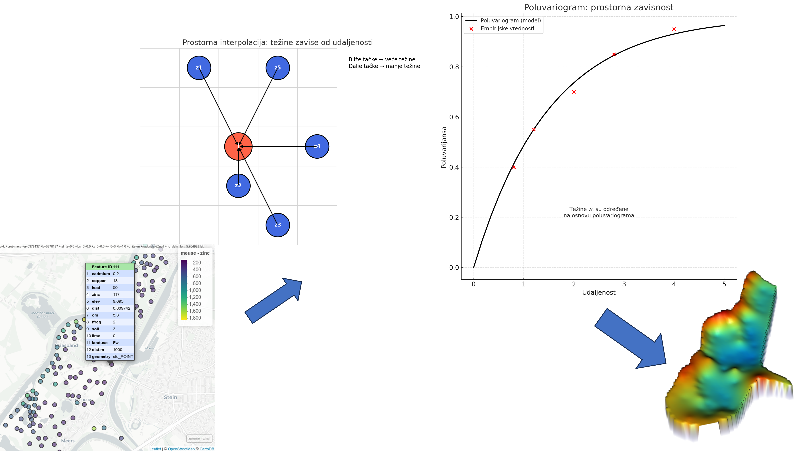

## Rezime: Kada koristiti koju metodu?

Odabir prave metode interpolacije zavisi od prirode samih podataka i fenomena koji se modelira. 
U tabeli ispod dat je kratak pregled preporučenih metoda bez prediktora:

| Tip podataka / Zahtev analize | Preporučena metoda |
|-------------------------------|--------------------|
| **Kategorički podaci / zona uticaja** | Najbliži sused / Voronoi  |
| **Vrlo glatki prelazi** (npr. temperature) | Spline / Kriging  |
| **Brza i osnovna procena** bez izlaska iz opsega merenja | IDW  |


# Metode za prostornu interpolaciju sa prediktorima bez prostorne autokorelacije

## Metode za prostornu interpolaciju sa prediktorima bez prostorne autokorelacije

-   Linearna regresija (MLR, GWR, GAM)
-   Random Forest (RF)
-   Support Vector Machines (SVM)
-   Artificial Neural Networks (ANN)
-   Gradient Boosting Machines (GBM)
-   Cubist, ...

## Metode za prostornu interpolaciju sa prediktorima

-   Predikcija vrednosti na nepoznatoj lokaciji $s_0$ se vrši kao linearna ili nelineran kombinacija vrednosti prediktora koji su poznati na celom području interpolacije.

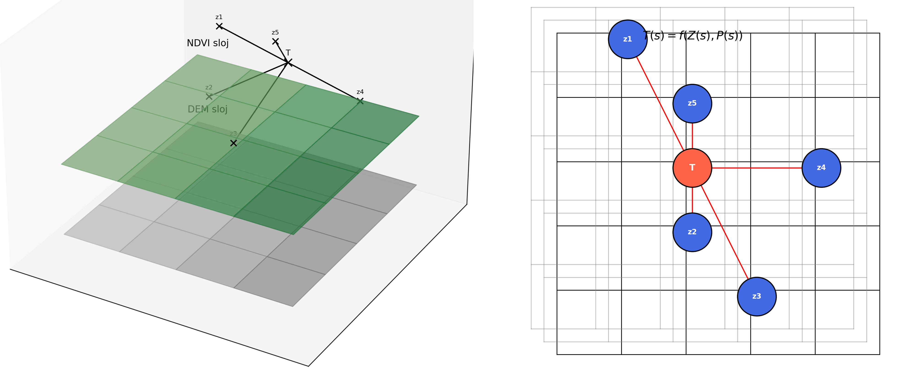

## Prostorna interpolacija – bazirane na prediktorima

Modeli interpolacije ($\mathbf{q}$ je matrica dizajna (design matrix). Ona sadrži vrednosti prediktora za sve uzorke):

::::: columns
::: {.column width="50%"}
**Opšta linearna regresija:**

$$
\hat{z}(s_0) = \sum_{k=0}^{n_c} \beta_k z_k(s_0)
$$ **Parametri modela:**

-   Klasična OLS procena:

$$
\hat{\beta}_{OLS} = (\mathbf{q}^T \mathbf{q})^{-1} \mathbf{q}^T \mathbf{z}
$$

-   Ponderisana LS procena:

$$
\hat{\beta}_{WLS}(s_0) = (\mathbf{q}^T \mathbf{W}(s_0) \mathbf{q})^{-1} \mathbf{q}^T \mathbf{W}(s_0) \mathbf{z}
$$
:::

::: {.column width="50%"}
**Generalizovana aditivna regresija (GAM):**

$$
\hat{z}(s_0) = \beta_0 + \sum_{k=0}^{n_c} f_k(s_0)
$$ $f_k(s_0)$ — glatke funkcije prediktora $k$ na lokaciji $s_0$
:::
:::::

## Metode mašinskog učenja (**RF**, SVM, ANN, GBM, Cubist)

-   Random Forest uči odnos između ciljne promenljive i prediktora na poznatim uzorcima i zatim koristi taj model da predviđa vrednosti na bilo kojoj lokaciji na osnovu dostupnih prediktora. (Kod ovog pristupa nema direktne primene prostorne autokorelacije, šta je bliže to je sličnije, ona je indirektno sadržana u prostiranju prediktora)

-   **RF** prvo pronalazi vezu između poznatih vrednosti ciljne promenljive (npr. koncentracije cinka) i odgovarajućih vrednosti prediktora (npr. nadmorska visina, udaljenost od reke, tip zemljišta). **RF model**.

-   **RF model** onda koristi poznate vrednosti prediktora dostupne za svaku tačku na području interpolacije da izvrši predikciju ciljne promenljive na nepoznatim lokacijama.

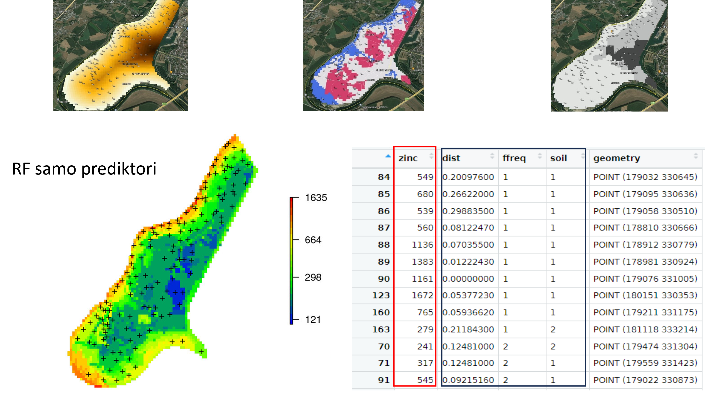

# Kombinovane metode: Regresioni kriging (opažanja + prediktori, trend i autokorelacija)

## Kombinovane metode: Regresioni kriging (opažanja + prediktori, trend i autokorelacija)

-   Trend se modelira regresijom, a rezidual se interpolira krigingom.
-   Rezidual je razlika između stvarne vrednosti i vrednosti dobijene regresijom.

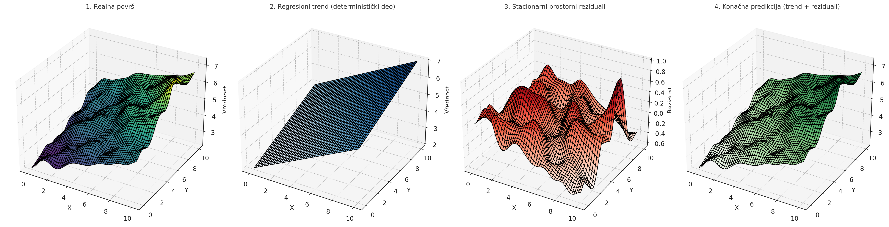

## Kombinovane metode: Regresioni kriging (opažanja + prediktori)

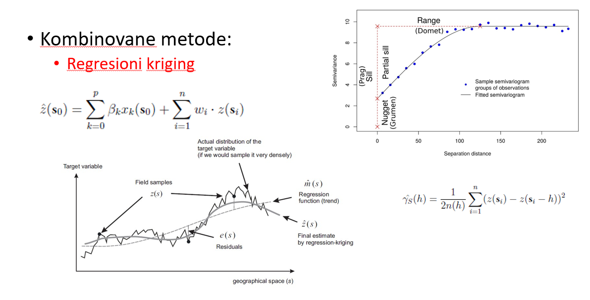

# Metode za prostornu vremensku interpolaciju

## Metode za prostornu vremensku interpolaciju koncept

-   Prostorna vremenska interpolacija se koristi za procenu vrednosti na nepoznatim lokacijama i vremenima na osnovu poznatih vrednosti na drugim lokacijama i vremenima.

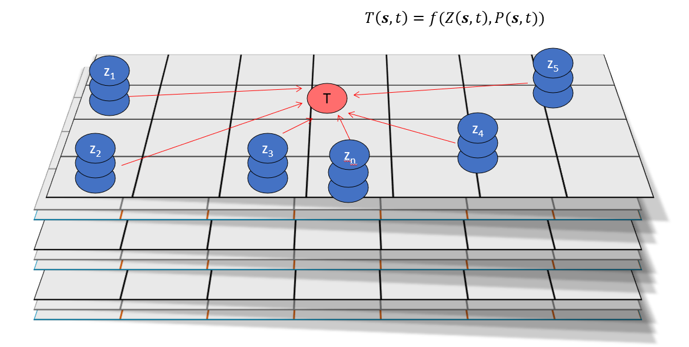

## Statistički model prostorno-vremenskog procesa, npr prostorno vremenski regresioni kriging

-   Prostorno-vremenski proces je slučajni proces koji zavisi od prostora i vremena. U ovom slučaju, prostorno-vremenski proces se može modelirati kao funkcija koja zavisi od prostora i vremena.
-   Može biti sa ili bez prediktora. U ovom slučaju sa prediktorima.

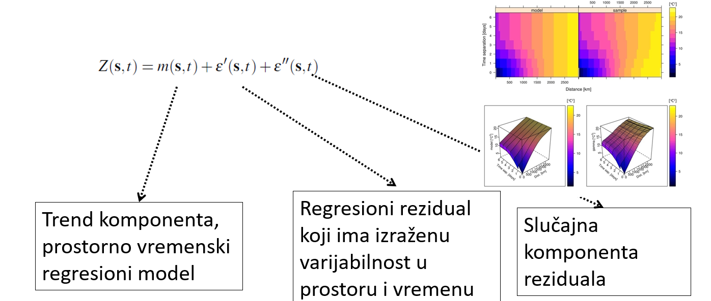

## Prostorno-vremenski regresioni kriging

Statistički model prostorno-vremenskog procesa:

$$
Z(s, t) = m(s, t) + \varepsilon'(s, t) + \varepsilon''(s, t)
$$

$m(s, t)$ – Trend komponenta

-   Deterministički deo modela (prostorno-vremenska regresija)

-   Zavisi od poznatih prediktora: npr. nadmorska visina, NDVI, dan u godini

-   Objašnjava sistematske promene u prostoru i vremenu

$\varepsilon'(s, t)$ – Prostorno-vremenski rezidual

-   Preostala varijabilnost koja je **prostorno i vremenski zavisna**

-   Modeluje se prostorno-vremenskim **krigingom**, prostorno vremenski variogramom.

-   Sadrži glatke, strukturisane obrasce

$\varepsilon''(s, t)$ – Slučajna komponenta reziduala

-   Nestrukturisan šum (nema prostornu ni vremensku zavisnost)

-   Obuhvata merne greške i mikroskopske varijacije

## Predikcija u prostorno-vremenskom regresionom krigingu

Model koji smo izgradili može da **predvidi vrednosti u bilo kojoj tački prostora i vremena** – čak i tamo gde nismo imali merenja.

### 🔍 Kako to funkcioniše?

-   Prvo koristi **poznate prostorne i vremenske podatke** (npr. nadmorska visina, NDVI koji varira u vremenu, dan u godini...)\
-   Zatim procenjuje **trend i prostorne šablone** na osnovu uzoraka i prediktora koji variraju u prostoru ili u prostoru i vremenu koje imamo\
-   Na kraju, u bilo kojoj novoj tački u domenu prostorno vremske kocke (čak i ekstrapolacija ako su poznati prediktori), model:
    -   koristi **poznate vrednosti prediktora** u toj tački
    -   primenjuje prostorno-vremensku interpolaciju reziduala
    -   i kombinuje sve u **konačnu procenu vrednosti**

> ✅ Rezultat: možemo doći do **kontinuirane karte** prostora i vremena.

## STRK primer interpolacija dnevnih temperatura

-   U modelu za prostorno-vremenski kriging korišćeni su prediktori koji obuhvataju i **prostorne karakteristike** i **prostorno vremenske serije**.

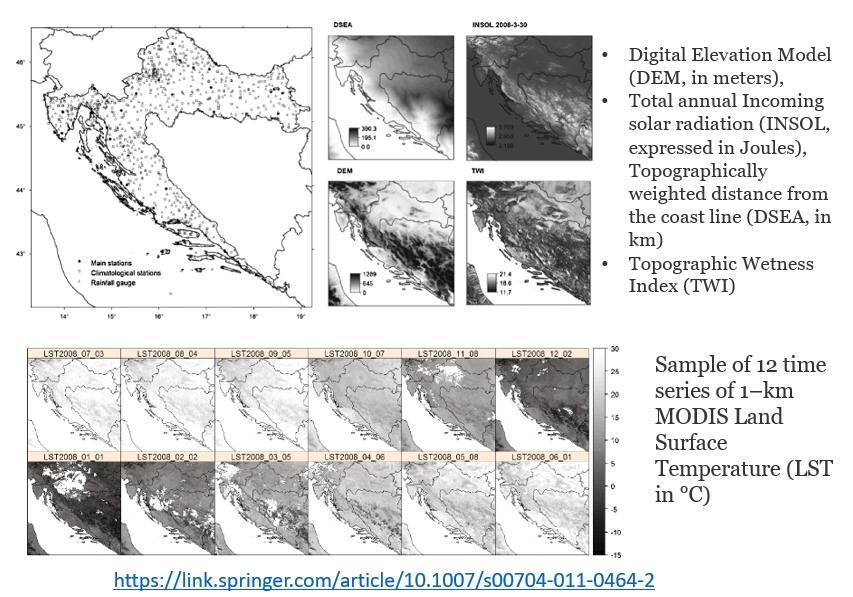

# Kombinovane metode sa mašinskim učenjem

## Kombinovane metode sa mašinskim učenjem

### Random Forest sa prostornim prediktorima, npr RFsp

Kombinovane metode spajaju klasične prediktore (npr. NDVI, nadmorska visina) i **prostorne informacije** (npr. rastojanja od uzoraka) kako bi model "naučio" i prostornu strukturu:

### 🔍 Kako funkcioniše:

-   ✅ Mašinski algoritam (npr. **Random Forest**) uči odnose između poznatih vrednosti i prediktora.
-   ✅ Dodatni slojevi kao što su **buffer distance maps** (jedan raster po uzorku) unose **prostornu informaciju** u model.
-   ✅ Model koristi sve slojeve da generiše **kontinuiranu prostornu kartu**.

## 📋 Primer RFsp regresione matrice

| Y   | A   | B   | C   | D_buf1 | D_buf2 | D_buf3 |
|-----|-----|-----|-----|--------|--------|--------|
| y1  | a1  | b1  | c1  | 0.25   | 0.74   | 0.63   |
| y2  | a2  | b2  | c2  | 0.10   | 0.65   | 0.90   |
| y3  | a3  | b3  | c3  | 0.18   | 0.60   | 0.70   |

### 🧭 Objašnjenje:

-   **Y** – zavisna promenljiva
-   **A, B, C** – klasični prediktori (npr. nadmorska visina, tip zemljišta, rastojanje od reke)
-   **D_buf1, D_buf2, D_buf3** – vrednosti iz **buffer distance karata**:
    -   svaka kolona predstavlja rastojanje od jednog uzorka na rasteru
    -   one unose **prostornu informaciju** u model

> ✅ Ova matrica omogućava Random Forest modelu da "nauči" i prostornu strukturu pomoću prostorno eksplicitnih prediktora.

## RFsp

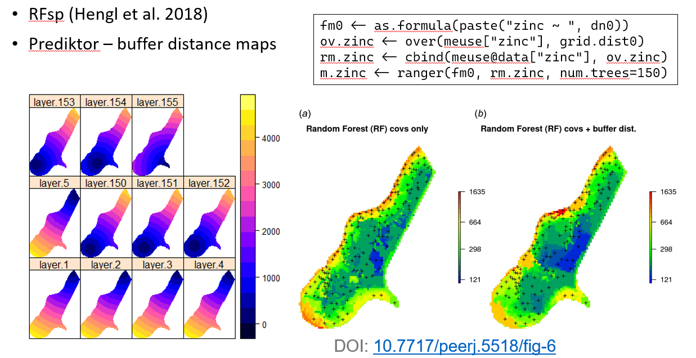

## 🌍 Random Forest Spatial Interpolation – RFSI

### Šta je RFSI?

RFSI je metoda koja kombinuje:

-   🧠 Mašinsko učenje (Random Forest)

-   📍 Informacije o **n najbližih tačaka** i njihovim vrednostima

-   ➕ Dodatne kovariate (NDVI, nadmorska visina...)

### 🔧 Kako funkcioniše?

-   Za svaku tačku za predikciju:
    -   pronalazi se **n najbližih uzoraka**
    -   koristi se njihova vrednost i udaljenost kao prediktori
-   Trening i predikcija se rade **koristeći prostorne kontekste**

## RFSI

$$
\hat{z}\left(s_0\right)=f\left(x_1\left(s_0\right), \ldots, x_m\left(s_0\right), z\left(s_1\right), d_1, z\left(s_2\right), d_2, z\left(s_3\right), d_3, \ldots, z\left(s_n\right), d_n\right)
$$

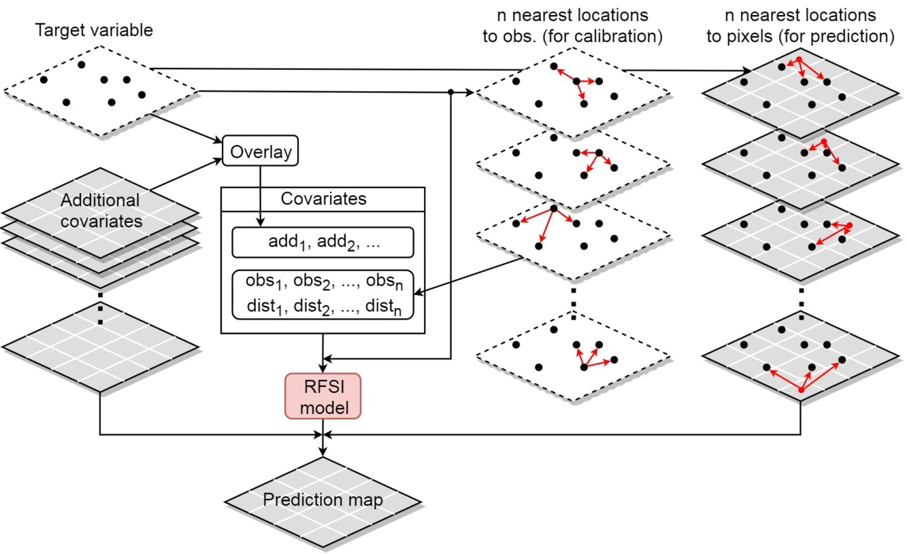

## 📊 RFSI regresiona matrica

Random Forest Spatial Interpolation koristi **regresionu matricu** u kojoj su, pored klasičnih prediktora, uključeni i:

-   🧩 Vrednosti najbližih suseda (`Q1`, `Q2`, ...)
-   📏 Udaljenosti do tih suseda (`D1`, `D2`, ...)

### 🔍 Struktura matrice:

-   `Y` – zavisna promenljiva (npr. koncentracija cinka)
-   `A`, `B`, `C` – klasični prediktori (npr. nadmorska visina, tip zemljišta, rastojanje od reke)
-   `Q1`, `Q2` – vrednosti `Y` kod najbližih tačaka
-   `D1`, `D2` – udaljenosti do tih najbližih tačaka

## 📋 Primer RFSI regresione matrice

| Y   | A   | B   | C   | Q1  | Q2  | D1  | D2  |
|-----|-----|-----|-----|-----|-----|-----|-----|
| y1  | a1  | b1  | c1  | y2  | y3  | d12 | d13 |
| y2  | a2  | b2  | c2  | y1  | y8  | d21 | d28 |
| y3  | a3  | b3  | c3  | y4  | y6  | d34 | d36 |
| y4  | a4  | b4  | c4  | y3  | y6  | d43 | d46 |

### 🧩 Objašnjenje kolona:

-   **Y** – zavisna promenljiva (ciljna vrednost za učenje)
-   **A, B, C** – klasični prediktori (npr. DEM...)
-   **Q1, Q2** – vrednosti zavisne promenljive kod najbližih tačaka
-   **D1, D2** – udaljenosti do tih najbližih tačaka

**Tokom treninga, algoritam 'sakriva' vrednost ciljne tačke i primorava Random Forest model da nauči kako da proceni njenu vrednost isključivo na osnovu suseda (Q1, Q2) i udaljenosti do njih (D1, D2).**

## ⚙️ Primer IDW interpolacije – meuse podaci

-   Podaci: `meuse`, koncentracija cinka (`zinc`)
-   Koordinate: `x`, `y`
-   Interpolacioni prostor, domen interpolacije: `meuse.grid`
-   Parametar: `idp = 2` (težina opada sa kvadratom udaljenosti)

```{r, echo=TRUE, eval=FALSE}
# Učitaj pakete
library(sp)
library(gstat)
library(raster)

# Učitaj podatke (kao sp)
data(meuse)
coordinates(meuse) <- ~x + y

data(meuse.grid)
gridded(meuse.grid) <- ~x + y

# IDW interpolacija
idw_result <- idw(formula = zinc ~ 1, locations = meuse, newdata = meuse.grid, idp = 2.0)
# Pretvori u raster za vizualizaciju
idw_raster <- raster(idw_result)
# Prikaži kartu
plot(idw_raster, main = "IDW interpolacija koncentracije cinka (meuse)")
points(meuse, pch = 20, col = "black")
```

## ⚙️ Primer IDW interpolacije – meuse podaci

```{r, echo=FALSE, eval=TRUE}
# Učitaj pakete
library(sp)
library(gstat)
library(raster)

# Učitaj podatke (kao sp)
data(meuse)
coordinates(meuse) <- ~x + y

data(meuse.grid)
gridded(meuse.grid) <- ~x + y

# IDW interpolacija
idw_result <- idw(formula = zinc ~ 1, locations = meuse, newdata = meuse.grid, idp = 2.0)
# Pretvori u raster za vizualizaciju
idw_raster <- raster(idw_result)
# Prikaži kartu
plot(idw_raster, main = "IDW interpolacija koncentracije cinka (meuse)")
points(meuse, pch = 20, col = "black")
```

## ⚙️ Primer NN interpolacije – meuse podaci

Nearest Neighbor (IDW sa `idp = 0 i nmax=1`) koristi najbližu poznatu tačku kao osnovu za predikciju vrednosti (**restrikcija komšiluka (nmax = 1) zapravo ono što definiše ovu metodu**).

-   Svaka ćelija rastera dobija vrednost najbližeg uzorka
-   Ova metoda je jednostavna, ali često daje **diskontinualanu** površinu

```{r, echo=TRUE, eval=TRUE}
# NN interpolacija (IDW sa idp = 0)
nn_result <- idw(zinc ~ 1, meuse, meuse.grid, nmax = 1,idp = 0)
nn_result <- raster(nn_result)
# Prikaz rezultata
plot(nn_result, main = "NN interpolacija koncentracije cinka (idp = 0))")
points(meuse, pch = '+', col = "black")
```

## Krosvalidacija

-   Krosvalidacija je tehnika koja se koristi za procenu performansi modela interpolacije.
-   U ovoj analizi, podaci su podeljeni na dva dela: **trening** i **test** skup.
-   Model se trenira na trening skupu, a zatim se testira na test skupu.
-   Prvo, delimo podatke na K delova.
-   Za svaki od tih delova, koristimo preostalih K−1 delova kao trening skup za podešavanje modela, dok se taj jedan deo koristi kao test skup za predikciju.
-   Na kraju, izračunavamo prosečnu grešku između stvarnih i predviđenih vrednosti, npr RMSE - srednju kvadratnu grešku.

$$
RMSE = \left(\frac{1}{n_{test}} \sum_{i=1}^{n_{test}} (y_i^{test} - \widehat{y_i^{test}})^2 \right)^{1/2},
$$

-   $n_{test}$: broj posmatranja u test skupu
-   $y_i^{test}$: stvarna vrednost u test skupu za i-tu tačku
-   $\widehat{y_i^{test}}$: predikovana vrednost modela za istu tačku

## Krosvalidacija

```{r, echo=FALSE}
library(sf)
library(ggplot2)
library(dplyr)

# Pretpostavka: meuse je već sf objekat
# Ako nije, konvertuj: meuse <- st_as_sf(meuse, coords = c("x", "y"), crs = 28992)

set.seed(123)  # radi reproduktivnosti

# 1. Dodaj nasumičnu podelu u K foldova
K <- 5
meuse$fold <- sample(1:K, size = nrow(meuse), replace = TRUE)
test_fold <- 3

# 2. Označi test vs. trening
meuse  <- st_as_sf(meuse)  |> 
  mutate(set = ifelse(fold == test_fold, "Test", "Train")) 

# 3. Vizualizacija
ggplot(meuse) +
  geom_sf(aes(color = set), size = 2) +
  scale_color_manual(values = c("Train" = "lightblue", "Test" = "red")) +
  labs(
    title =  "Prostorna K-fold krosvalidacija (meuse podaci)",
    color = "Skup"
  ) +
  theme_minimal() +
  theme(
    plot.title = element_text(size = 14, face = "bold"),
    legend.position = "right"
  )

```

## IDW krosvalidacija generički pristup

```{r}
set.seed(123)
library(dismo)
# Function to calculate the RMSE
RMSE <- function(observed, predicted) {sqrt(mean((observed - predicted)^2))}

# Split data in 5 sets
kf <- dismo::kfold(nrow(meuse), k = 5) # K-fold partitioning
# Vektor za smeštanje rezultata
rmse <- rep(NA, 5) # IDW

for(k in 1:5) {
# Split data in test and train
test <- meuse[kf == k, ]
train <- meuse[kf != k, ]
# IDW
gs <- gstat(formula = zinc ~ 1, locations = train,
            nmax = nrow(train), set = list(idp = 2))
p2 <- predict(gs, test)$var1.pred
rmse[k] <- RMSE(test$zinc, p2)
}
rmse
mean(rmse)
```

## IDW krosvalidacija gstat metod

```{r}
# 5-fold IDW krosvalidacija (idp = 2)
cv_5fold_idw <- krige.cv(
  formula = zinc ~ 1,
  locations = meuse,
  nfold = 5,
  set = list(idp = 2)
)

#  Rezultati
head(cv_5fold_idw)
summary(cv_5fold_idw$residual)

#  RMSE za 5-fold
rmse_5fold <- sqrt(mean(cv_5fold_idw$residual^2))
cat("5-fold IDW RMSE:", round(rmse_5fold, 2), "\n")
```

## IDW krosvalidacija gstat metod

```{r}
cv_5fold_idw
```

## IDW krosvalidacija gstat metod karta reziduala

```{r}
ggplot(cv_5fold_idw) +
  geom_sf(aes(color = residual), size = 2) +
  scale_color_gradient2(
   low = "#2166AC", mid = "grey90", high = "#B2182B", midpoint = 0
  ) +
  labs(
    title = "Reziduali 5-fold IDW krosvalidacije",
    color = "Rezidual"
  ) +
  theme_minimal()
```

## Krosvalidacija metrike

```{r}
res <- cv_5fold_idw$residual
pred <- cv_5fold_idw$var1.pred
obs  <- cv_5fold_idw$observed

# Metrike
rmse   <- sqrt(mean(res^2))  # Root Mean Squared Error
mae    <- mean(abs(res))     # Mean Absolute Error
me     <- mean(res)          # Mean Error (bias)
r2     <- cor(pred, obs)^2   # R-squared
mape   <- mean(abs(res) / obs) * 100  # Mean Absolute Percentage Error
medae  <- median(abs(res))   # Median Absolute Error
iqrres <- IQR(res)           # Interquartile range of residuals
maxres <- max(abs(res))      # Maksimalna greška
nrmse  <- rmse / (max(obs) - min(obs))  # Normalized RMSE
```

## Krosvalidacija metrike

```{r}
# Tabela rezultata
metrics <- data.frame(
  RMSE  = rmse,
  MAE   = mae,
  ME    = me,
  R2    = r2,
  MAPE  = mape,
  MedAE = medae,
  IQR   = iqrres,
  MaxAbsError = maxres,
  NRMSE = nrmse
)

# Zaokruži za pregled
round(metrics, 3)
```

## 🧱 Primer Voronoi interpolacije – meuse podaci

-   Prostor se deli na **Voronoi poligone**
-   Za svaku tačku izračunamo granicu sa njenim susedima – to su prave koje se nalaze na sredini između dve tačke.
-   Kombinovanjem tih granica nastaje zatvoren poligon oko svake tačke.
-   Ceo prostor biva podeljen u nepreklapajuće regije – Voronoi dijagram.
-   Nema učenja iz odnosa sa drugim tačkama

```{r}
library(terra)
library(sf)
# Voronoi
v <- terra::voronoi(x = terra::vect(meuse), bnd = rast(meuse.grid))
meuse  <- st_as_sf(meuse) 
plot(v["zinc"],  main = "Voronoi interpolacija")
points(st_geometry(meuse), cex = 0.5)
```

## ⚙️ Primer Spline interpolacije – meuse podaci

-   Spline interpolacija koristi **glatke funkcije** (obično polinome) da napravi **kontinuiranu površinu** kroz poznate vrednosti.\

-   Za razliku od IDW i Voronoi metoda, Spline interpolacija daje **glatke prelaze** i pokušava da **minimizuje zakrivljenost površine**.

-   Koristi se za podatke koji imaju **glatke promene** i gde je važno očuvati kontinuitet.

```{r eval=FALSE}
# install.packages("fields")
library(fields)

# 2. Ekstrahuj koordinate i vrednosti
x <- st_coordinates(meuse)[,1]
y <- st_coordinates(meuse)[,2]
zinc <- meuse$zinc
# 3. Fituj Thin Plate Spline model
tps_model <- Tps(cbind(x, y), zinc)
# 4. Napravi grid za predikciju
coords <- coordinates(meuse.grid)
# 5. Predikcija
pred <- predict(tps_model, coords)
# 6. Rasterizuj rezultat za prikaz
library(raster)
zinc_raster <- rasterFromXYZ(cbind(coords, pred))
# 7. Prikaz
plot(zinc_raster, main = "Spline interpolacija (Thin Plate Spline)")
points(x, y, pch = 20, col = "black")
```

## ⚙️ Primer Spline interpolacije – meuse podaci

```{r eval=TRUE, echo=FALSE}
# install.packages("fields")
library(fields)
meuse  <- st_as_sf(meuse) 
# 2. Ekstrahuj koordinate i vrednosti
x <- st_coordinates(meuse)[,1]
y <- st_coordinates(meuse)[,2]
zinc <- meuse$zinc
# 3. Fituj Thin Plate Spline model
tps_model <- Tps(cbind(x, y), zinc)
# 4. Napravi grid za predikciju
coords <- coordinates(meuse.grid)
# 5. Predikcija
pred <- predict(tps_model, coords)
# 6. Rasterizuj rezultat za prikaz
library(raster)
zinc_raster <- rasterFromXYZ(cbind(coords, pred))
# 7. Prikaz
plot(zinc_raster, main = "Spline interpolacija (Thin Plate Spline)")
points(x, y, pch = 20, col = "black")
```

## Kriging (*Ordinary Kriging*) meuse variogram

-   Zanemarićemo činjenicu da je bolje transoformisati podatke pre kriginga, da bi raspodela bila što bliže normalnoj (u ovom slučaju bila bi dobra log transformacija koncentracije cinka).

-   Koristimo originalne vrednosti.

```{r}
# 1. Učitaj podatke
data(meuse)
coordinates(meuse) <- ~x + y
# 2. Izračunaj eksperimentalni variogram
v <- variogram(zinc ~ 1, meuse)
# 3. Fituj model (sferični variogram)
v.fit <- fit.variogram(v, model = vgm("Sph"))
# 4. Prikaz
plot(v, v.fit, main = "Eksperimentalni i fitovani variogram (Spherical model)")
```

## Kriging (*Ordinary Kriging*) meuse

```{r}
ok_result <- krige(zinc ~ 1, meuse, meuse.grid, model = v.fit)
spplot(ok_result["var1.pred"], main = "Ordinary Kriging – predikcija cinka")
```

## Kriging (*Ordinary Kriging*) meuse karta varijansi

```{r}
spplot(ok_result["var1.var"], main = "Ordinary Kriging – varijansa predikcije")
```

## Kriging (*Ordinary Kriging*) meuse standardna greška

```{r}
ok_result$kriging_se <- sqrt(ok_result$var1.var)
# Prikaz karte standardne greške
spplot(ok_result["kriging_se"], main = "Standardna greška – Ordinary Kriging")
```

## Kriging (*Ordinary Kriging*) meuse krosvalidacija LOO

```{r}
cv_ok <- krige.cv(zinc ~ 1, meuse, model = v.fit, nfold = nrow(meuse))

# RMSE i ostale metrike
res <- cv_ok$residual
obs <- cv_ok$observed
pred <- cv_ok$var1.pred

rmse <- sqrt(mean(res^2))
mae <- mean(abs(res))
r2 <- cor(obs, pred)^2

cat("Ordinary Kriging - Krosvalidacija:\n")
cat("RMSE:", round(rmse, 2), "\n")
cat("MAE :", round(mae, 2), "\n")
cat("R²  :", round(r2, 3), "\n")
```

## Kriging (*Ordinary Kriging*) meuse reziduali iz krosvalidacije LOO

```{r}
spplot(cv_ok, "residual", main = "Reziduali – Kriging krosvalidacija (LOO)")
```

## Regresioni model meuse

```{r}
lm_model <- lm(zinc ~ dist + soil + ffreq, data = meuse)
summary(lm_model)

# Predikcija regresionog modela na gridu
meuse.grid$lm_pred <- predict(lm_model, newdata = meuse.grid)
```

## Regresioni model meuse

```{r}
# Prikaz kao karta (spplot)
spplot(meuse.grid["lm_pred"], main = "Predikcija regresionog modela (zinc ~ dist + soil + ffreq)")
```

## Regresioni kriging

```{r}
meuse$residuals <- residuals(lm_model)

#  Kriging reziduala
vg <- variogram(residuals ~ 1, data = meuse)
vg_fit <- fit.variogram(vg, model = vgm("Sph"))

rk_krige <- krige(residuals ~ 1, meuse, meuse.grid, model = vg_fit)

# Predikcija regresijom na gridu
grid_df <- as.data.frame(meuse.grid)
grid_df$lm_pred <- predict(lm_model, newdata = grid_df)
```

## Regresioni kriging predikcija trend + reziduali

```{r}
# Kombinovanje regresije + kriging reziduala
rk_result <- grid_df$lm_pred + rk_krige$var1.pred
meuse.grid$rk_pred <- rk_result
# Prikaz rezultata
spplot(meuse.grid["rk_pred"], main = "Regression Kriging – koncentracija cinka")
```

## RF interpolacija

```{r}
library(ranger)
# Random Forest model
rf_model <- ranger(zinc ~ dist + soil + ffreq, data = as.data.frame(meuse), num.trees = 100)
rf_model
```

## RF predikcija na gridu

```{r}
# Predikcija na gridu
rf_pred <- predict(rf_model, data = as.data.frame(meuse.grid))$predictions
# Dodaj predikciju u meuse.grid
meuse.grid$rf_pred <- rf_pred
# Prikaz rezultata
spplot(meuse.grid["rf_pred"], main = "Random Forest – koncentracija cinka")
```

## RF primer prostorne krosvalidacije

```{r}
# Koristimo kmeans clustering na koordinatama za stvaranje prostornih foldova
coords <- meuse@coords
n_folds <- 5
folds <- kmeans(coords, centers = n_folds)$cluster
# 2. Inicijalizacija vektora za pohranu predikcija
meuse$rf_cv_pred <- NA
# 3. Sprovedi prostornu krosvalidaciju
for (i in 1:n_folds) {
  # Podeli podatke na train i test
  train_data <- meuse[folds != i, ]
  test_data <- meuse[folds == i, ]
  # Treniraj model na train dijelu
  rf_model <- ranger(zinc ~ dist + soil + ffreq, 
                     data = as.data.frame(train_data), 
                     num.trees = 100)
  # Predikcija na test dijelu
  meuse$rf_cv_pred[folds == i] <- predict(rf_model, data = as.data.frame(test_data))$predictions
}
# 4. Izračunaj metrike performansi
# RMSE
rmse <- sqrt(mean((meuse$zinc - meuse$rf_cv_pred)^2))
# R-squared
rsq <- cor(meuse$zinc, meuse$rf_cv_pred)^2
# 5. Prikaz rezultata
cat(paste0("Prostorna krosvalidacija - RMSE: ", round(rmse, 2), 
           ", R-squared: ", round(rsq, 2), "\n"))
```

## RF primer prostorne krosvalidacije prikaz foldova

```{r}
meuse$fold <- as.factor(folds)
spplot(meuse, "fold", main = "Prostorni foldovi za krosvalidaciju")
```

## RF primer prostorne krosvalidacije reziduali

```{r}
# Prikaz stvarnih vs predviđenih vrijednosti
ggplot(as.data.frame(meuse), aes(x = zinc, y = rf_cv_pred)) +
  geom_point() +
  geom_abline(intercept = 0, slope = 1, color = "red") +
  labs(title = "Stvarne vs predviđene vrijednosti (prostorna CV)",
       x = "Stvarna koncentracija cinka", 
       y = "Predviđena koncentracija cinka") +
  annotate("text", x = min(meuse$zinc), y = max(meuse$rf_cv_pred),
           label = paste0("RMSE = ", round(rmse, 2), "\nR² = ", round(rsq, 2)),
           hjust = 0, vjust = 1)
```

## Distribucija grešaka po foldovima

```{r}
# Dodatno: Prikaz distribucije grešaka po foldovima
meuse$residual <- meuse$zinc - meuse$rf_cv_pred
ggplot(as.data.frame(meuse), aes(x = as.factor(fold), y = residual)) +
  geom_boxplot() +
  labs(title = "Distribucija grešaka po foldovima",
       x = "Fold", y = "Residual (stvarno - predviđeno)")
```

## RF nasumična krosvalidacija

```{r}
# Postavi seed za reproduktivnost
set.seed(123)
# 1. Definisanje foldova (5-fold CV)
n_folds <- 5
meuse$fold <- sample(1:n_folds, nrow(meuse), replace = TRUE)
# 2. Inicijalizacija vektora za pohranu predikcija
meuse$rf_cv_pred <- NA
# 3. Provedi krosvalidaciju
for (i in 1:n_folds) {
  # Podeli podatke na train i test
  train_data <- meuse[meuse$fold != i, ]
  test_data <- meuse[meuse$fold == i, ]
  # Treniraj model na train delu
  rf_model <- ranger(zinc ~ dist + soil + ffreq, 
                     data = as.data.frame(train_data), 
                     num.trees = 100)
  # Predikcija na test delu
  meuse$rf_cv_pred[meuse$fold == i] <- predict(rf_model, data = as.data.frame(test_data))$predictions
}
# 4. Izračunaj metrike performansi
rmse <- sqrt(mean((meuse$zinc - meuse$rf_cv_pred)^2, na.rm = TRUE))
rsq <- cor(meuse$zinc, meuse$rf_cv_pred, use = "complete.obs")^2
cat(paste0("Nasumična krosvalidacija - RMSE: ", round(rmse, 2), 
           ", R-squared: ", round(rsq, 2), "\n"))
```

## RF primer nasumične krosvalidacije prikaz foldova

```{r}
meuse$fold <- as.factor(meuse$fold)
spplot(meuse, "fold", main = "Nasumični foldovi za krosvalidaciju")
```

## RF primer nasumične krosvalidacije reziduali

```{r}
# Prikaz stvarnih vs predviđenih vrijednosti
ggplot(as.data.frame(meuse), aes(x = zinc, y = rf_cv_pred)) +
  geom_point() +
  geom_abline(intercept = 0, slope = 1, color = "red") +
  labs(title = "Stvarne vs predviđene vrijednosti (nasumična CV)",
       x = "Stvarna koncentracija cinka", 
       y = "Predviđena koncentracija cinka") +
  annotate("text", x = min(meuse$zinc), y = max(meuse$rf_cv_pred),
           label = paste0("RMSE = ", round(rmse, 2), "\nR² = ", round(rsq, 2)),
           hjust = 0, vjust = 1)
```

## RFsp Buffer distance maps

Buffer distance slojevi predstavljaju rastere u kojima svaka ćelija sadrži udaljenost do jedne poznate uzorkovane tačke.

-   Za **n uzoraka** pravi se **n rastera**, po jedan za svaku tačku.
-   Svaki sloj koristi se kao dodatni prostorni prediktor u Random Forest modelu.
-   Ovi slojevi omogućavaju modelu da "nauči" prostornu strukturu bez klasičnog variograma.

## RFsp Buffer distance maps

```{r}
library(terra)
library(sf)

# Konverzija meuse u sf
data(meuse)
meuse_sf <- st_as_sf(meuse, coords = c("x", "y"), crs = 28992)
# Raster mreža (grid)
data(meuse.grid)
grid_df <- meuse.grid
coordinates(grid_df) <- ~x + y
gridded(grid_df) <- TRUE
proj4string(grid_df) <- CRS("+init=epsg:28992")
grid_ras <- rast(grid_df)
meuse_ras <- grid_ras[["dist"]]

# Buffer distance rasteri
buffer_rasters <- lapply(1:nrow(meuse_sf), function(i) {
  p <- vect(meuse_sf[i, ])
  dist_ras <- distance(meuse_ras, y = p)
  names(dist_ras) <- paste0("dist_", i)
  dist_ras
})
# Kombinuj u jedan SpatRaster
buffer_stack <- do.call(c, buffer_rasters)
```

## RFsp Buffer distance maps prikaz nekoliko slojeva

```{r}
plot(buffer_stack[[1:4]], main = "Buffer distance rasteri")
```

## RFsp Buffer distance maps rasteri i ostali prediktori

```{r}
library(terra)
# Kombinuj: klasični + buffer rasteri
predictor_stack <- c(buffer_stack, grid_ras[["dist"]], grid_ras[["soil"]], grid_ras[["ffreq"]])
names(predictor_stack)
```

## Prostorni overlay sa prediktorima

```{r}
buffer_vals <- extract(predictor_stack, vect(meuse_sf))
train_df <- cbind(zinc=meuse$zinc, buffer_vals[,-1])  # -1 Ukloni ID kolonu
names(train_df )
```

## RFsp Random Forest model

```{r}
# Random Forest model
rfsp_model <- ranger(zinc ~ ., data = train_df, num.trees = 100, importance = "impurity")
rfsp_model
```

## RFsp predikcija na gridu

```{r}
# Konvertuj u data.frame
predict_df <- as.data.frame(predictor_stack, xy = TRUE, na.rm = TRUE)
# Predikcija
rfsp_pred <- predict(rfsp_model, data = predict_df)
predict_df$zinc_rfsp <- rfsp_pred$predictions

# Pretvori u raster
zinc_rfsp_ras <- rast(cbind(predict_df[, c("x", "y")], predict_df$zinc_rfsp), type = "xyz")
```

## RFsp prikaz rezultata

```{r}
plot(zinc_rfsp_ras, main = "RFsp – predikcija koncentracije cinka")
```

## RFSI inetepolacija

```{r, warning=FALSE}
# library(devtools)
# install_github("https://github.com/AleksandarSekulic/Rmeteo")
library(meteo)
# prepare data
demo(meuse, echo=FALSE)
meuse <- meuse[complete.cases(meuse@data),]
data = st_as_sf(meuse, coords = c("x", "y"), crs = 28992, agr = "constant")
#################### rfsi ####################
fm.RFSI <- as.formula("zinc ~ dist + soil + ffreq")
# fit the RFSI model
rfsi_model <- rfsi(formula = fm.RFSI,
                   data = data, # meuse.df (use data.staid.x.y.z)
                   zero.tol = 0,
                   n.obs = 5, # number of nearest observations
                   cpus = detectCores()-1,
                   progress = TRUE,
                   importance = "impurity",
                   seed = 42,
                   num.trees = 250,
                   mtry = 5,
                   splitrule = "variance",
                   min.node.size = 5,
                   sample.fraction = 0.95,
                   quantreg = FALSE)
```

## RFSI model summary

```{r}
rfsi_model
```

## RFSI predikcija

```{r, warning=FALSE}
newdata <- terra::rast(meuse.grid)
class(newdata)

# prediction
rfsi_prediction <- pred.rfsi(model = rfsi_model,
                             data = data, # meuse.df (use data.staid.x.y.z)
                             obs.col = "zinc",
                             newdata = newdata, # meuse.grid.df (use newdata.staid.x.y.z)
                             output.format = "SpatRaster", # "sf", # "SpatVector", 
                             zero.tol = 0,
                             cpus = 1, # detectCores()-1,
                             progress = TRUE)


```

## RFSI predikcija plot

```{r}
plot(rfsi_prediction, main = "RFSI predikcija koncentracije cinka")
```

## RFSI podešavanje modela i krosvalidacija

-   Detalji dostupni na linku: <https://github.com/AleksandarSekulic/Rmeteo/blob/master/demo/RFSI.R>
-   Rad <https://doi.org/10.3390/rs12101687>

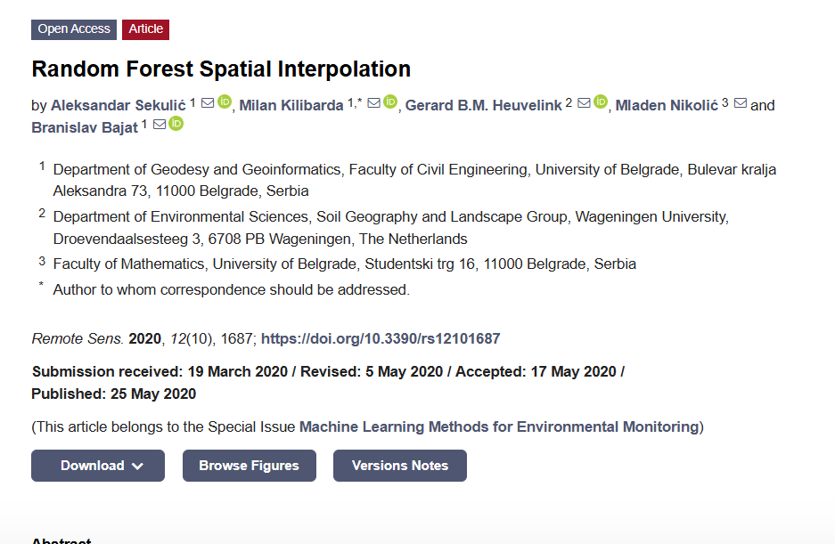

# Prostorno vremenska geostatistika

## Prostorno vremenski kriging

**Prostorno-vremenski kriging** omogućava modelovanje podataka koji imaju izraženu prostorno vremensku varijabilnost.

-   Variogram generalizovan na prostornu i vremensku dimenziju
-   Kriging se primenjuje kroz prostor i vreme
-   Povećava tačnost interpolacije kada su podaci gusti u vremenu

## Priprema prostornih podataka i vremenska serija podatka

```{r}
library(stars)
library(xts)
# https://github.com/edzer/sdsr_exercises/tree/main/data/ch13.RData
# 'aqsel' xts matrica (8760xN) sa NO2 podacima, 
# a 'no2_sf' sf objekat stanica (sa kolonama station_european_code, geometry, itd).
load("data/aqsel.rda")

url = "https://raw.githubusercontent.com/r-spatial/gstat/master/inst/external/no2.csv"
no2.sf = read.csv(url) |> 
    st_as_sf(coords = c("station_longitude_deg", "station_latitude_deg"),
             crs = st_crs(4326))
plot(no2.sf["NO2"], pch = 16)
```

## Priprema `stars` objekta

```{r}
no2.sf <- st_transform(no2.sf, crs=32632)
# Kreiranje stars objekta od matrice
no2.st <- st_as_stars(list(NO2 = as.matrix(aqsel))) |>
  st_set_dimensions(names = c("time", "station")) |>          # Imenovanje dimenzija
  st_set_dimensions("time", values = index(aqsel)) |>         # Postavljanje vremenskih indeksa (POSIXct)
  st_set_dimensions("station", values = st_geometry(no2.sf))  # Prostorne koordinate stanica
no2.st
```

Ovim smo dobili prostorno-vremenski data cube: dimenzija time (vremenske oznake) i dimenzija station (prostorne lokacije mernih stanica). Svaka instanca sadrži vrednost $NO_2$ koncentracije za datu stanicu u datom satu.

## Izračunavanje prostorno-vremenskog varijagrama

Empirijski prostorno-vremenski variogram kvantifikuje varijaciju podataka u zavisnosti od:

-   Prostorne udaljenosti
-   Vremenskog razmaka
-   Zbog velike količine podataka, često je praktično računati variogram na podskupu (npr. prvih mesec dana)

```{r eval=FALSE}
library(gstat)
# Računanje spatio-temporal variograma za NO2; tlags = 0 do 48 sati (2 dana)
v.st <- variogramST(NO2~1, data = no2.st[, 1:(24*31)], tlags = 0:48,  cores = getOption("mc.cores", 6))
```

```{r echo=FALSE}
library(gstat)
load( "data/vst.rda")
```

## Prikaz prostorno-vremenskog eksperimentalnog varijograma

-   Levi panel prikazuje semivariance (gamma) u funkciji prostorne udaljenosti (osa x) i vremenskog pomaka (osa y predstavlja time lag u satima), sa bojama koje predstavljaju veličinu gamma.

-   Desni panel prikazuje isto to kroz skup krivih – svaka kriva je variogram za određeni vremenski lag, pri čemu je boja krive (od plave ka žutoj) proporcionalna rastu vremenskog laga.

```{r}
v1 <- plot(v.st)
v2 <- plot(v.st, map = FALSE, legend = list())
print(v1, split = c(1,1,2,1), more = TRUE)
print(v2, split = c(2,1,2,1), more = FALSE)
```

## Fitovanje variograma

Definiše **početni model prostorno-vremenskog variograma** korišćenjem **product-sum pristupa**:

-   `space = vgm(...)`: eksponencijalni model za **prostornu komponentu**

    -   *Sill* = 150, *range* = 200,000 m, *nugget* = 0

-   `time = vgm(...)`: sferni model za **vremensku komponentu**

    -   *Sill* = 20, *range* = 6 časova, *nugget* = 0

-   `k = 2`: skalirajući faktor koji kombinuje prostor i vreme

-   `stAni`: prostorno-vremenska anizotropija (proporcija između prostorne i vremenske varijacije)

```{r}
# product-sum
prodSumModel <- vgmST("productSum",
    space = vgm(150, "Exp", 200000, 0),
    time = vgm(20, "Sph", 6, 0),
    k = 2)
#v.st$dist = v.st$dist / 1000
StAni <- estiStAni(v.st, c(0,200000))
(fitProdSumModel <- fit.StVariogram(v.st, prodSumModel,
    fit.method = 7, stAni = StAni, method = "L-BFGS-B",
    control = list(parscale = c(1,100000,1,1,0.1,1,10)),
    lower = rep(0.0001, 7)))
```

## Prikaz fitovanog variograma

```{r}
plot(v.st, model = fitProdSumModel, wireframe = TRUE, all = TRUE, 
     scales = list(arrows = FALSE), zlim = c(0, 185))
```

## Pripremimo dve nasumične tačke za predikciju

-   Predikcija vremenske serije na novim tačkama. Pretpostavimo da želimo da predvidimo $NO_2$ koncentraciju na dve nove lokacije (koje nisu u skupu stanica) tokom cele godine 2017.

-   Prvo izaberemo dve prostorne tačke (nasumično ili određeno) u okviru posmatrane oblasti i pripremimo stars objekat koji ima sve vremenske instance za te tačke (dimenzije: time × 2 new points)

```{r}
set.seed(1331)
pt <- st_sample(st_bbox(no2.st), 2)
t <- st_get_dimension_values(no2.st, 1)
st_as_stars(list(pts = matrix(1, length(t), length(pt)))) |>
    st_set_dimensions(names = c("time", "station")) |>
    st_set_dimensions("time", t) |>
    st_set_dimensions("station", pt) -> new_pt
```

## Predikcija na novim tačkama

```{r, eval=TRUE}
crs = 32632
no2.st <- st_transform(no2.st, crs)
new_ts <- krigeST(NO2~1, data = no2.st["NO2"], 
                  newdata = dplyr::slice(new_pt, along="time",1:100),
         nmax = 10, stAni = StAni, modelList = fitProdSumModel,
         progress = FALSE)
plot(as.xts(new_ts["var1.pred"]))
```

## Priprema prostorno vremenskog grida za predikciju

```{r}
# Kreiranje prostornog grida (10km raster)
grd <- st_as_stars(st_bbox(no2.sf), dx = 10000, dy = 10000)

d <- dim(grd)
# t4 <- t[(1:4 - 0.5) * (3*24*30)]
# Pravljenje prazan stars sa dimenzijama x, y, time (4 vremenska isečka)
t4  <- as.POSIXct(c("2017-01-01 12:00:00", "2017-04-01 12:00:00", "2017-07-01 12:00:00", "2017-10-01 12:00:00"), tz = "CET")

st_as_stars(pts = array(1, c(d[1], d[2], time = length(t4)))) |>
    st_set_dimensions("time", t4) |>
    st_set_dimensions("x", st_get_dimension_values(grd, "x")) |>
    st_set_dimensions("y", st_get_dimension_values(grd, "y")) |>
    st_set_crs(32632) -> grd.st
```

## Predikcija na gridu

```{r, eval=FALSE}
# Predikcija na prostornom gridu proces je spor zbog operacija sa orgomnim matricama
new_int <- krigeST(NO2~1, data = no2.st["NO2"], newdata = grd.st,
         nmax = 200, stAni = StAni, modelList = fitProdSumModel,
         progress = TRUE)
names(new_int)[2] = "NO2"

plot(new_int["NO2"])

png("imgs/STK.png", width = 2000, height = 1500, res = 300, units = "px")
plot(new_int["NO2"])  
dev.off()
```

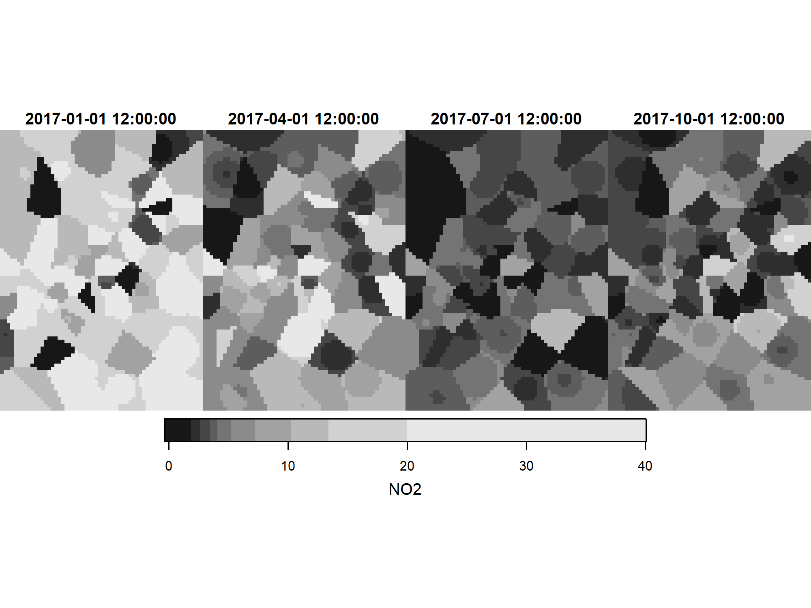

## Literatura

-   Pebesma, E.; Bivand, R. (2023). Spatial Data Science: With Applications in R (1st ed.). 314 pages. Chapman and Hall/CRC, Boca Raton. <https://doi.org/10.1201/9780429459016>

-   Breiman, L. (2001). Random Forests. Machine Learning, 45(1), 5–32. <https://doi.org/10.1023/A:1010933404324>

-   Hengl, T., Nussbaum, M., Wright, M. N., Heuvelink, G. B. M., & Gräler, B. (2018). Random forest as a generic framework for predictive modeling of spatial and spatio-temporal variables. PeerJ, 6, e5518. <https://doi.org/10.7717/peerj.5518>

-   Huffman, G., Bolvin, D., Braithwaite, D., Hsu, K., Joyce, R., Xie, P. (2014). Integrated Multi-satellitE Retrievals for GPM (IMERG), version 4.4. NASA's Precipitation Processing Center, accessed 31 March, 2019, <ftp://jsimpson.pps.eosdis.nasa.gov/data/imerg/gis/>

-   Kilibarda, M., Hengl, T., Heuvelink, G. B. M., Gräler, B., Pebesma, E., Perčec Tadic, M., Bajat, B. (2014). Spatio-temporal interpolation of daily temperatures for global land areas at 1 km resolution. Journal of Geophysical Research Atmospheres, 119(5), 2294–2313. <https://doi.org/10.1002/2013JD020803>

-   Sekulić, A., Kilibarda, M., Heuvelink, G. B., Nikolić, M. & Bajat, B. Random Forest Spatial Interpolation.Remote. Sens. 12, 1687,<https://doi.org/10.3390/rs12101687> (2020).

-   <https://github.com/AleksandarSekulic/RFSI>
